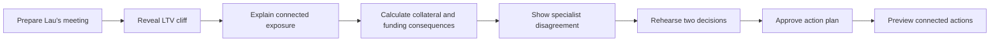
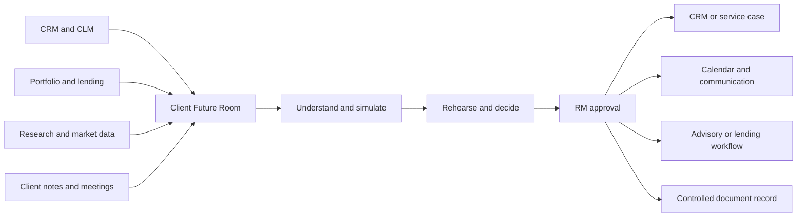
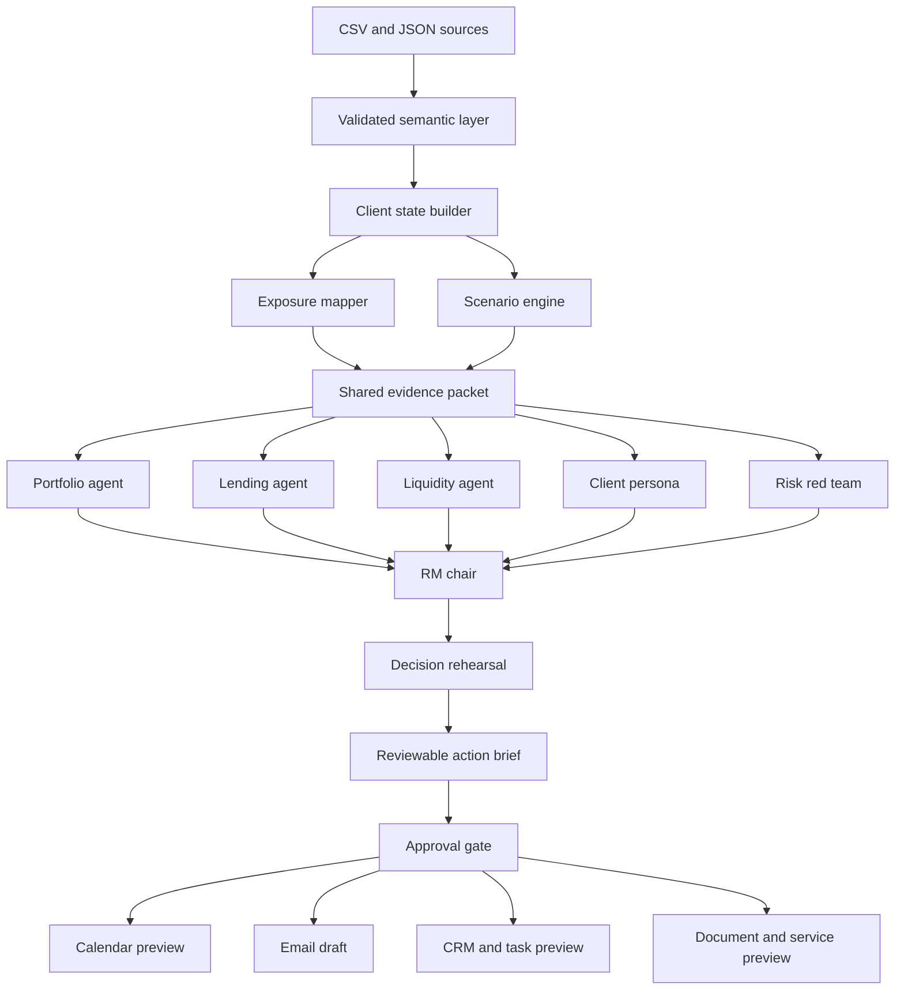

# Product Requirements Document: Client Future Room

## Document summary

| Field | Value |
|---|---|
| Product | Client Future Room |
| Challenge | SingHacks 2026 - Julius Baer Wealth Intelligence |
| Primary user | Relationship Manager |
| Demo case | Lau Chi Ming, client `CL-0014` |
| Data as of | 26 August 2026 |
| Product stage | Hackathon MVP |
| Decision | Build one complete client decision journey instead of a broad portfolio dashboard |
| Strategic outcome | Increase trusted growth throughput by reducing RM administration and advancing suitable client outcomes faster |

## 1. Executive summary

Client Future Room is a personalized decision-support experience for Relationship Managers.
It connects a client's investments, source of wealth, borrowing, liquidity, objectives, and future cash needs into one explainable view.
It is the decision-to-execution layer across the RM's existing systems, not a replacement for CRM, client lifecycle management, portfolio, research, or productivity platforms.
The experience opens directly in one client case and begins with one prominent **Prepare Lau's meeting** action.
That action reveals the connected exposure, runs a transparent stress scenario, convenes specialist AI agents, starts a decision rehearsal, and produces an actionable Relationship Manager brief.

The MVP focuses exclusively on Lau Chi Ming.
He is a Hong Kong property developer whose business wealth, direct property, listed securities, structured product, credit facility, and future redevelopment requirement depend on the same economic outcome.
His HKD 58 million facility is currently at 69.41% loan-to-value against a 70% margin-call trigger.
A decline of approximately 0.85% in lending value would cross the trigger.
He also needs HKD 60 million for a confirmed redevelopment contribution by mid-2027.

The demo answers one clear question:

> If Hong Kong property weakens, what happens to Lau's collateral and redevelopment plan, and how should his Relationship Manager prepare for the conversation?

The product does not predict markets or execute transactions.
It calculates consequences from explicit assumptions, exposes the evidence behind every claim, and keeps the Relationship Manager responsible for the final decision.
It deliberately avoids a chatbot interface.
Its broader commercial purpose is to give each RM more capacity to acquire, onboard, and serve clients while advancing suitable revenue opportunities faster.
The MVP proves that strategy through one relationship-deepening case rather than pretending the supplied data can measure acquisition or revenue.

## 2. Product thesis

Traditional portfolio tools show accounts and asset allocations separately.
They often miss risks that appear only when the client's full financial situation is connected.

For Lau, a property shock can affect several parts of his situation at the same time:

1. Property-linked investments lose value.
2. Lending value falls.
3. Facility LTV crosses its trigger.
4. Cash is required to cure or reduce the risk.
5. The same cash may be needed for the HKD 60 million redevelopment contribution.
6. Selling assets can change mandate alignment, income generation, and exposure to the client's preferred investment theme.

Client Future Room makes this chain visible and actionable.

### 2.1 Strategic product position

Most systems in the RM workflow are systems of record or specialist tools.
They store a client relationship, run onboarding, account for a portfolio, distribute research, check suitability, or coordinate work.
Client Future Room sits above those systems for one bounded purpose: convert scattered signals into an evidence-backed client decision and an approved set of follow-through actions.

The operating loop is:

```text
Detect -> understand -> simulate -> decide -> rehearse -> approve -> write back -> learn
```

The product is therefore best understood as a **commercial orchestration layer with client-trust guardrails**.
It creates capacity for growth by reducing preparation and administration, improving the quality of prioritization, and preventing useful insight from dying before it becomes a client outcome.

### 2.2 Commercial north star

The recommended north star is **trusted growth throughput**.
It measures how many commercially meaningful client outcomes an RM advances per hour while satisfying evidence, suitability, and approval requirements.

Raw revenue maximization is not an acceptable product objective.
It can reward product pushing, underweight service obligations, and create conflicts with client goals.
Revenue is an outcome to improve within hard client-interest and control constraints.

| Dimension | What the product should improve | Example production KPIs |
|---|---|---|
| Growth | Acquire, deepen, and retain suitable relationships | Qualified pipeline, net new money, recurring revenue, share-of-wallet progress, opportunity conversion |
| Speed | Move a valid client need to an outcome quickly | Time to first contact, onboarding cycle time, time to funded account, insight-to-approved-action time |
| Service | Resolve important needs before they become problems | Proactive coverage, service-level adherence, client goal progress, retention, outflow-risk resolution |
| Capacity | Return RM time to client-facing work | Preparation time, administrative time, manual re-entry, systems visited per case |
| Control | Preserve trust and regulatory defensibility | KYC completeness, suitability exceptions, rework, unsupported claims, complaints, unapproved actions |

Revenue or revenue-potential values may appear only when approved pricing, probability, attribution, and product-economics data are connected.
Until then, the interface should report the client outcome advanced and the RM effort saved, not an invented currency value.

## 3. Why the MVP uses one case study

The full dataset supports many client stories, but a broad demo would force judges to learn too many concepts at once.
The MVP therefore optimizes for one memorable story with a clear cause-and-effect sequence.

Lau is the strongest case because it combines:

- A concentrated economic theme that appears in multiple investment wrappers.
- A secured credit facility close to its trigger.
- A large, dated future cash requirement.
- A client belief captured in Relationship Manager notes.
- A result that can be calculated deterministically and explained visually.
- A realistic disagreement between the client, lending officer, liquidity planner, and Relationship Manager.

The underlying platform should remain extensible to other clients, but no additional client workflow is required for the MVP demo.

## 4. Problem statement

### 4.1 User problem

Relationship Managers must combine information from portfolio systems, lending systems, planning records, client notes, and market research before a client conversation.
The information is available, but the dependencies between it are difficult to see.

The work continues after the conversation.
RMs and their assistants must capture notes, update CRM records, coordinate specialists, request documents, progress onboarding or service cases, schedule follow-ups, and preserve an audit trail.
Repeated system switching and manual re-entry reduce the time available for prospecting, advice, and relationship building.

In Lau's case, a standard portfolio view may show individual property positions, an LTV figure, and a future cash need on different screens.
It may not explain that they are parts of one funding-chain risk.

### 4.2 Business problem

The bank needs advisory insights that are personalized, timely, explainable, and subject to human review.
An insight that cannot show its assumptions and supporting records is not suitable for a client conversation.

The bank also needs those insights to advance measurable commercial outcomes.
The relevant outcome may be a new funded relationship, retained assets, a larger share of wallet, a suitable lending or investment solution, a resolved service issue, or an explicit decision not to proceed.
Speed matters, but only after client need, suitability, and control requirements are satisfied.

### 4.3 Product opportunity

The opportunity is to turn fragmented client data into a decision model that answers:

- What matters now?
- Why does it matter to this client?
- What could happen under a stated scenario?
- What options should the Relationship Manager consider?
- What should the Relationship Manager ask the client before acting?
- Which approved action should be written back to which system?
- What client outcome and commercial stage moved forward?

### 4.4 External workflow evidence

Industry research supports the underlying capacity problem, although published findings should not be treated as a measured Julius Baer baseline.

- A McKinsey survey of 406 frontline bankers, RMs, and sales leaders in the United States and Canada found that administrative work, lead quality, and meeting preparation constrain client-facing capacity.
The same research describes lead prioritization, preparation, documentation, and approvals as a connected automation opportunity.
[McKinsey, Agentic AI is here. Is your bank's frontline team ready?](https://www.mckinsey.com/industries/financial-services/our-insights/agentic-ai-is-here-is-your-banks-frontline-team-ready)
- McKinsey's wealth-management research organizes value creation across acquisition and onboarding, engagement and deepening, and service and retention.
It also describes Asian next-best-conversation and digital-workbench examples that connect client events and transactions to RM action.
[McKinsey, Analytics transformation in wealth management](https://www.mckinsey.com/industries/financial-services/our-insights/analytics-transformation-in-wealth-management)
- EY's 2026 global wealth research reports substantial client willingness to move assets and continued use of multiple wealth managers.
This makes retention, service quality, and share of wallet part of the commercial problem rather than secondary experience metrics.
[EY, Client expectations and competition for assets](https://www.ey.com/en_gl/newsroom/2026/06/client-expectations-rise-as-wealth-managers-face-increasing-competition-for-assets-ey-report)
- Julius Baer has publicly described technology programs intended to improve guided onboarding, compliant advisory work, engagement opportunities, and RM efficiency while maintaining the human relationship.
Its current AI direction emphasizes scalable, responsible foundations rather than isolated tools and names advisory, risk, and internal-productivity use cases already in place.
[Julius Baer guided digital onboarding](https://www.juliusbaer.com/en/media/news-portal/julius-baer-enables-its-private-clients-to-be-onboarded-digitally/), [Julius Baer Digital Advisory Suite in Asia](https://www.juliusbaer.com/sg/en/news/julius-baer-launches-award-winning-digital-advisory-platform-in-asia/), and [Julius Baer on its global AI transformation](https://www.juliusbaer.com/en/insights/company-insights/behind-the-scenes/how-julius-baers-20-years-in-asia-are-shaping-its-global-ai-transformation/)

## 5. Users and stakeholders

### 5.1 Primary user

**Priscilla Ong, Relationship Manager**

Priscilla manages 20 clients across the Singapore and Hong Kong booking centers.
She needs to identify urgent issues, prepare for client discussions, and coordinate with specialists.
She remains accountable for reviewing, editing, approving, or rejecting the system's output.

### 5.2 Demo client persona

**Lau Chi Ming, client `CL-0014`**

| Attribute | Value |
|---|---|
| Life stage | Peak earning years |
| Source of wealth | Hong Kong residential and commercial property development |
| Risk profile | Balanced |
| Risk tolerance score | 5 of 10 |
| Investment horizon | 12 years |
| Liquidity need | High |
| Current AUM | USD 26.49 million |
| Main objective | Generate yield, retain exposure to a Hong Kong property recovery, and fund a redevelopment project |
| Future need | HKD 60 million by 30 June 2027 |
| Facility | HKD 70 million limit, HKD 58 million drawn |
| Current LTV | 69.41% |
| Margin-call trigger | 70.00% |

Lau is confident that the Hong Kong property market will recover.
His notes show that he views repeated exposure to this theme as conviction rather than concentration.
The product must respect that preference while making the consequences and tradeoffs unambiguous.

### 5.3 Internal stakeholders represented in the product

- Lending officer
- Portfolio specialist
- Liquidity planner
- Structured-products specialist
- Risk and compliance reviewer
- Wealth planner

## 6. Jobs to be done

### Primary job

> Before speaking with Lau, help me understand how a Hong Kong property shock would affect his investments, facility, and redevelopment plan, then help me prepare a defensible conversation.

### Supporting jobs

- Show where the same economic exposure appears under different product labels.
- Calculate the client's distance to the facility trigger.
- Distinguish total wealth from eligible lending value.
- Show which assets are liquid enough to support an urgent cure.
- Compare emergency liquidity with the future redevelopment requirement.
- Present options and tradeoffs without making an autonomous recommendation.
- Provide evidence for every material claim.
- Identify missing information that must be confirmed with the client or a specialist.
- Convert an agreed next step into the correct CRM, calendar, task, document, onboarding, or service workflow without duplicate data entry.
- Record whether the case protected, deepened, retained, or acquired a relationship without confusing activity with revenue.

### Commercial lifecycle jobs

The Lau MVP demonstrates the **serve and deepen** stages of a broader relationship lifecycle.
The production product should support the same decision-to-execution pattern across all stages.

| Lifecycle stage | RM job | Future Room contribution |
|---|---|---|
| Discover and qualify | Decide which introductions and prospects deserve attention | Assemble a consented prospect dossier, explain fit, expose missing facts, and prepare the first conversation |
| Onboard | Move a qualified relationship to a funded account | Surface KYC and document blockers, coordinate ownership, and show the next action that controls time to revenue |
| Advise | Turn client context and market events into suitable choices | Connect exposures and goals, simulate consequences, compare tradeoffs, and rehearse the conversation |
| Serve | Resolve requests and obligations quickly | Triage the request, retrieve context, create an owned action plan, and update the service record |
| Deepen and retain | Earn a larger, more durable relationship | Detect life events, held-away needs, lending or planning gaps, and outflow risk without pushing products |
| Follow through | Make sure the decision becomes an outcome | Draft approved records, tasks, meetings, and communications, then monitor completion |

## 7. Product goals

### 7.1 MVP goals

1. Make Lau's connected Hong Kong property exposure understandable within 30 seconds.
2. Let the judge run one preconfigured scenario with a single action.
3. Recalculate portfolio value, lending value, LTV, and trigger status deterministically.
4. Show how the scenario affects the HKD 60 million redevelopment plan.
5. Run specialist agents in parallel and expose useful disagreement.
6. Let the presenter rehearse two consequential moments in the client conversation.
7. Produce an editable, evidence-linked action brief with owners and due dates.
8. Prepare approval-gated calendar, email, task, and document actions.
9. Ensure the entire demo can be completed in five minutes.
10. Show that the case advances a client goal and a commercially relevant relationship outcome without fabricating revenue.

### 7.2 Longer-term goals

- Support every client in the Relationship Manager's book.
- Add event-driven and life-event scenarios.
- Add historical as-of evaluation and monitoring.
- Support policy-controlled external research.
- Learn from approved, rejected, and deferred recommendations.
- Support prospect qualification and guided onboarding as a separate Prospect Future Room.
- Write approved decisions back to CRM, client lifecycle, service, and records systems.
- Measure trusted growth throughput across the RM's book.

### 7.3 Judging-criteria alignment

| Criterion | How the MVP demonstrates it |
|---|---|
| Client-Centric Innovation | Lau's investments, borrowing, business wealth, belief, and dated redevelopment goal become one personalized decision model |
| User Experience and Design | One prominent trigger leads through a visual consequence chain, structured disagreement, rehearsal, and an owned action plan without a chatbot |
| Technical and Operational Feasibility | Deterministic calculations, evidence lineage, source-system boundaries, approval gates, and connector previews fit a regulated architecture |
| Strategic Impact | The product improves trusted growth throughput by returning RM capacity and moving suitable client outcomes from insight to execution |

## 8. Non-goals

The MVP will not:

- Predict the future price of Hong Kong property.
- Produce Value at Risk or probabilistic forecasts from five snapshots.
- Execute trades, facility changes, or client communications.
- Provide legal or tax advice.
- Research the synthetic client name on the public web.
- Optimize the entire portfolio automatically.
- Model every structured-product payoff in full detail.
- Support all 20 clients in the primary demo journey.
- Treat agreement among AI agents as a compliance approval.
- Present a generic chat box, assistant avatar, message thread, or open-ended chatbot as the primary interaction.
- Send an email, create a meeting, or assign a task without explicit RM approval.
- Rank prospects or clients using sensitive traits or opaque propensity scores.
- Recommend a product because it pays more when a lower-cost suitable option better serves the client.
- Display estimated revenue without governed pricing, probability, attribution, and product-economics inputs.
- Replace CRM, KYC and onboarding, portfolio accounting, order management, research distribution, or records management.

## 9. Experience principles

### 9.1 One story at a time

The interface should lead with a single sentence explaining why Lau needs attention.
Secondary metrics should support that sentence rather than compete with it.

### 9.2 Consequences before recommendations

The system must show what changes under the scenario before it presents possible actions.

### 9.3 Calculations are deterministic

Code calculates values, ratios, thresholds, and scenario outcomes.
Language models explain and compare the results.

### 9.4 Evidence is always available

Every important claim must link to its source record, date, formula, or scenario assumption.

### 9.5 Disagreement is useful

The agent council should reveal genuine tradeoffs rather than force artificial consensus.

### 9.6 The Relationship Manager remains in control

The final output is a draft for review.
It is never presented as an approved recommendation or direct client communication.

### 9.7 Visuals carry the story

The LTV stress chart is the first analytical visual because crossing a visible threshold is immediately understandable.
The connected-exposure graph explains why the threshold is vulnerable.
A compact holdings table provides detail without becoming the primary experience.

### 9.8 No chatbot behavior

The product uses deliberate actions, structured specialist positions, and selectable rehearsal responses.
It does not ask the RM to begin with an empty prompt or read simulated message bubbles.

### 9.9 Close the loop

The experience ends with a concrete action plan containing owners, due dates, approvals, and optional productivity integrations.

### 9.10 Client need before commercial value

Every commercial opportunity must begin with a documented client need, objective, event, or service issue.
The interface should show **why this helps the client** before it shows any pipeline or revenue field.
Suitability and evidence are blocking gates, not secondary badges.

### 9.11 Integrate instead of duplicate

Client Future Room may assemble context and prepare approved updates, but each durable record belongs in its existing system of record.
The RM should never have to reconcile a shadow CRM created by the product.

## 10. Core user journey



### Step 1: See why Lau needs attention

Priscilla opens Lau's Future Room.
The application opens directly in Lau's case instead of showing a generic client-book dashboard.
The page leads with:

> Lau's property exposure, secured borrowing, and HKD 60 million redevelopment need depend on the same market outcome.

The page shows three supporting facts:

- 49.0% of the portfolio is directly linked to Hong Kong property through four holdings.
- Current LTV is 69.41% against a 70.00% trigger.
- HKD 60 million is required by 30 June 2027.
- A prominent **Prepare Lau's meeting** button is the only primary action.

### Step 2: Inspect the connected exposure map

Priscilla sees a simple network or grouped flow that connects:

```text
Property development source of wealth
            |
            +-- Direct Mid-Levels property
            +-- Golden Harbour shares
            +-- Golden Harbour perpetual bond
            +-- Golden Harbour accumulator
            +-- HKD 58m secured borrowing
            +-- HKD 60m redevelopment requirement
```

Each node shows current value, portfolio weight, liquidity tier, and whether it contributes to lending value.

### Step 3: Watch the scenario run

The **Prepare Lau's meeting** action automatically runs the preconfigured **Moderate Hong Kong Property Stress** scenario after the baseline is revealed.

The product animates the consequence chain without requiring the judge to configure individual market factors or launch another workflow.

### Step 4: Review the impact

The result focuses on four numbers:

- Portfolio market value declines by HKD 18.23 million.
- Lending value declines from HKD 83.57 million to HKD 78.44 million.
- Facility LTV rises from 69.41% to 73.94%.
- Approximately HKD 3.09 million of external cash or debt reduction would be required to restore LTV to 70%, assuming lending value remains unchanged after the action.

The product also explains that cash used for an immediate facility cure may reduce the funds available for the 2027 redevelopment contribution.

### Step 5: Review the specialist council

Specialist agents automatically analyze the same calculated state in parallel after the numerical result is available.
The interface presents their positions in a decision table rather than a conversation thread.

The result should show concise positions such as:

- Lending officer: reduce LTV before another property-linked decline.
- Liquidity planner: preserve enough HKD liquidity for the redevelopment contribution.
- Portfolio specialist: reduce duplicated exposure in stages rather than abandon the client's market view.
- Client persona: resist selling property exposure near a perceived recovery point.
- Risk reviewer: identify assumptions, unsupported claims, and required disclosures.

### Step 6: Rehearse the decision

The interface presents the client's documented position:

> The property market turns this year.

The presenter chooses one of three RM opening approaches.
The client persona responds using only documented beliefs and behavior.
The presenter then chooses one follow-up response.
The rehearsal ends with qualitative coaching and a concrete next-step outcome.

### Step 7: Review the action brief

The product produces a draft action brief with:

- What changed
- Why it matters to Lau
- Scenario assumptions
- Consequences
- Three possible response paths
- Tradeoffs for each path
- Expected client objections
- Questions to clarify
- Missing data and specialist referrals
- Evidence links
- Approval status
- Action owners
- Due dates
- Approval-gated connector previews

### Step 8: Preview connected execution

After RM approval, the interface prepares a calendar event, email draft, internal task plan, and stored meeting brief.
The demo previews all connector actions and may execute a calendar action only when the integration has been tested and explicitly approved.
It then shows a compact **Relationship Outcome** strip:

- Client goal advanced: redevelopment funding resilience reviewed.
- Risk obligation advanced: LTV buffer options assigned.
- Relationship stage advanced: specialist review scheduled.
- Records prepared: CRM note, tasks, calendar event, and meeting brief.

The strip must not show a revenue estimate because the challenge dataset lacks governed pricing and attribution data.
Its purpose is to make the business outcome legible without turning the experience into a sales dashboard.

## 11. MVP information architecture

The demo should use one continuous guided page with six sequential stages.
This avoids making judges navigate a complex application.
Only completed and current stages are visually prominent.
Later stages remain visible as a quiet progression rail so judges understand where the experience is going.

### Section A: Attention banner

Purpose: explain the problem immediately.

Required content:

- Client name and as-of date
- One-sentence risk summary
- Current LTV and trigger
- Property-linked portfolio percentage
- Redevelopment amount and due date
- A prominent **Prepare Lau's meeting** button
- No search box, prompt box, or client-book dashboard in the primary demo view

### Section B: LTV cliff and same-bet map

Purpose: show immediate urgency first, then explain why the client is vulnerable.

Required content:

- A horizontal or sloped LTV chart showing 69.41% today, the 70.00% trigger, and 73.94% under stress
- Clear before and after labels that do not depend on color
- Source of wealth
- Four property-linked investments
- Credit facility
- Future cash need
- Position values and portfolio weights
- Liquidity and lending-value eligibility
- Clickable evidence details
- A compact supporting holdings table below the graph

### Section C: Scenario consequences

Purpose: make the stress result understandable without financial modeling knowledge.

Required content:

- Before and after LTV
- Distance to trigger
- Before and after lending value
- Before and after total market value
- Estimated external-cash or debt-reduction requirement
- Liquidity available now
- Redevelopment need remaining
- A short explanation of the consequence chain

### Section D: Specialist decision table

Purpose: reveal useful disagreement without presenting simulated chat.

Required content:

- Specialist positions
- Areas of agreement
- Areas of disagreement
- Three response options
- Open questions
- Evidence and assumptions

### Section E: Decision rehearsal

Purpose: let the presenter practice how to turn a correct insight into a constructive client conversation.

Required content:

- One documented client position
- Three selectable RM opening approaches
- One adaptive client objection
- Three selectable follow-up approaches
- Qualitative coaching on clarity, empathy, evidence use, and progress toward action
- A visible rehearsal outcome such as **constructive next step**, **stalled**, or **defensive**
- No numeric conversation score
- No free-form prompt box or chat bubbles

### Section F: Action brief and Action Bridge

Purpose: convert the analysis and rehearsal into an RM-controlled execution plan.

Required content:

- Core insight
- Why it matters now
- Three proposed next steps
- Action owner and due date for each step
- Client questions
- Missing information and uncertainty
- Specialist referrals
- Edit, approve, and reject controls for the draft brief
- Approval-ready calendar, email, task, and document previews
- A compact Relationship Outcome strip showing the client goal, risk obligation, relationship stage, and systems updated
- No unsupported revenue or probability figure

### 11.1 Desktop interface wireframe

```text
┌─────────────────────────────────────────────────────────────────────────────┐
│ CLIENT FUTURE ROOM                                    As of 26 Aug 2026     │
│ Lau Chi Ming  /  Balanced  /  High liquidity need                          │
├─────────────────────────────────────────────────────────────────────────────┤
│ His property exposure, secured borrowing, and HKD 60m project depend on    │
│ the same market outcome.                                                    │
│                                                                             │
│ 69.41% LTV          70.00% trigger          HKD 60m due Jun 2027            │
│                                                                             │
│                         [ Prepare Lau's meeting ]                            │
├──────────────────────────────────────┬──────────────────────────────────────┤
│ LTV CLIFF                            │ SAME-BET MAP                         │
│ 69.41% ───── 70% ─────▶ 73.94%      │ Property business                   │
│ current       trigger     stressed   │   ├ holdings                        │
│                                      │   ├ secured facility                 │
│ HKD 3.09m estimated cure             │   └ redevelopment need               │
├──────────────────────────────────────┴──────────────────────────────────────┤
│ SPECIALIST DECISION TABLE                                                   │
│ Lending         Liquidity         Portfolio         Client         Risk     │
│ Protect now     Preserve HKD      Reduce in stages  Retain view    Verify   │
├─────────────────────────────────────────────────────────────────────────────┤
│ DECISION REHEARSAL                                                          │
│ Client position: "The property market turns this year."                    │
│ [Lead with trigger] [Protect the project] [Lead with concentration]         │
├─────────────────────────────────────────────────────────────────────────────┤
│ ACTION BRIEF                                                                │
│ 1 Confirm external liquidity     Lau       Due 05 Sep                       │
│ 2 Convene specialist review      RM        Due 08 Sep                       │
│ 3 Evaluate LTV buffer options    Lending   Due 12 Sep                       │
│                                                                             │
│ [Edit plan] [Preview connected actions] [Approve plan]                      │
├─────────────────────────────────────────────────────────────────────────────┤
│ RELATIONSHIP OUTCOME                                                        │
│ Goal advanced  •  Buffer review assigned  •  Specialist meeting prepared   │
│ CRM note  •  Tasks  •  Calendar  •  Brief                    Ready to sync  │
└─────────────────────────────────────────────────────────────────────────────┘
```

### 11.2 Visual hierarchy

The interface should feel like a refined editorial private-banking workspace.
It should not resemble a retail trading terminal, generic analytics dashboard, or AI assistant.

The hierarchy is:

1. One-sentence client insight
2. One primary action
3. LTV threshold visualization
4. Connected-exposure explanation
5. Specialist disagreement
6. Rehearsal choices
7. Action plan and execution previews
8. Relationship outcome advanced

### 11.3 Visual language

- Use a warm ivory background with charcoal text and restrained burgundy accents.
- Reserve amber and red for the movement toward and across the LTV trigger.
- Use a refined serif for major client insight statements and a highly legible sans serif for data and controls.
- Avoid dark-mode neon styling, gradients, glass effects, excessive shadows, and repeated rounded cards.
- Use open editorial spacing and thin structural rules instead of placing every element in a container.
- Keep the primary button visually dominant until it is pressed.
- After the trigger, convert the button area into a visible stage-progress indicator.

### 11.4 Chart specifications

#### LTV cliff chart

- Show current LTV, trigger, and stressed LTV on one continuous scale.
- Keep the 70% trigger fixed while the scenario animates.
- Use position, labels, and line treatment in addition to color.
- Show the estimated cure requirement beside the breached state.
- Complete the transition within 700 milliseconds using smooth deceleration.
- Respect reduced-motion preferences by switching values without animation.

#### Same-bet exposure graph

- Use the client's property business as the root node.
- Connect the four holdings, facility, and redevelopment need through labeled relationships.
- Encode position size by node area within a restrained range.
- Encode liquidity using text labels rather than relying on node color.
- Reveal the graph from the central economic theme outward after the LTV result appears.
- Allow each node to open its evidence details without navigating away.

#### Supporting holdings table

- Show instrument, economic theme, current value, portfolio weight, liquidity tier, advance rate, and stressed value.
- Sort property-linked positions first.
- Keep the table compact and secondary to the two primary visuals.

### 11.5 Responsive behavior

The judged demo is desktop-first, but the interface must remain functional on smaller screens.
On tablet, the LTV chart stacks above the exposure graph.
On mobile, the experience becomes a vertical guided sequence with the action brief remaining fully available.
Critical calculations, evidence, and approval controls must not be hidden on mobile.

## 12. Functional requirements

### 12.1 Client state construction

| ID | Requirement | Priority |
|---|---|---|
| FR-001 | Build a single state object for `CL-0014` as of 26 August 2026. | P0 |
| FR-002 | Aggregate all current holdings across the client's portfolios. | P0 |
| FR-003 | Include client profile, objectives, source of wealth, and relevant RM notes. | P0 |
| FR-004 | Include facility limit, drawn amount, lending value, LTV, and trigger. | P0 |
| FR-005 | Include planned cash needs with currency, amount, date range, and certainty. | P0 |
| FR-006 | Preserve source identifiers and dates for every state field. | P0 |

### 12.2 Exposure mapping

| ID | Requirement | Priority |
|---|---|---|
| FR-010 | Identify the four property-linked holdings used in the demo. | P0 |
| FR-011 | Calculate their combined portfolio weight. | P0 |
| FR-012 | Display liquidity tier and advance rate for every position. | P0 |
| FR-013 | Connect the holdings to the client's source of wealth and future project. | P0 |
| FR-014 | Resolve the Golden Harbour accumulator to its underlying reference. | P0 |
| FR-015 | Allow the user to inspect the evidence behind each connection. | P1 |

### 12.3 Scenario engine

| ID | Requirement | Priority |
|---|---|---|
| FR-020 | Provide one preconfigured Moderate Hong Kong Property Stress scenario. | P0 |
| FR-021 | Apply explicit price shocks by instrument or exposure category. | P0 |
| FR-022 | Recalculate market value using the current holdings snapshot. | P0 |
| FR-023 | Recalculate lending value using each holding's advance rate. | P0 |
| FR-024 | Recalculate LTV as drawn amount divided by stressed lending value. | P0 |
| FR-025 | Calculate whether the margin-call trigger has been crossed. | P0 |
| FR-026 | Calculate the debt reduction required to return to the trigger using external cash. | P0 |
| FR-027 | Preserve a before-state, assumptions, after-state, and calculation trace. | P0 |
| FR-028 | Allow a simple property-stress slider after the preconfigured run succeeds. | P1 |
| FR-029 | Support additional saved scenarios. | P2 |

### 12.4 Agent council

| ID | Requirement | Priority |
|---|---|---|
| FR-030 | Run specialist agents against an identical evidence packet and calculated scenario result. | P0 |
| FR-031 | Require every agent claim to reference evidence or an explicit assumption. | P0 |
| FR-032 | Return each agent's position, reasoning, proposed action, concerns, and questions. | P0 |
| FR-033 | Show disagreement without forcing consensus. | P0 |
| FR-034 | Run a red-team pass that rejects unsupported claims and arithmetic inconsistencies. | P0 |
| FR-035 | Prevent agents from changing calculated values. | P0 |
| FR-036 | Display agent progress in parallel for demo clarity. | P1 |

### 12.5 Meeting brief

| ID | Requirement | Priority |
|---|---|---|
| FR-040 | Generate one editable meeting brief from the approved scenario result. | P0 |
| FR-041 | Include three response paths with tradeoffs. | P0 |
| FR-042 | Include likely client objections grounded in RM notes. | P0 |
| FR-043 | Include open questions and specialist referrals. | P0 |
| FR-044 | Include scenario assumptions and evidence references. | P0 |
| FR-045 | Mark the document as a draft requiring RM review. | P0 |
| FR-046 | Allow the RM to edit, approve, or reject the draft. | P1 |
| FR-047 | Export a one-page PDF or printable view. | P2 |

### 12.6 Decision rehearsal

| ID | Requirement | Priority |
|---|---|---|
| FR-050 | Start the rehearsal automatically after specialist positions are available. | P0 |
| FR-051 | Present three structured opening approaches without a text prompt. | P0 |
| FR-052 | Generate a client objection using only supported client facts and RM notes. | P0 |
| FR-053 | Present three structured follow-up approaches. | P0 |
| FR-054 | End after two RM decisions so the full demo remains under five minutes. | P0 |
| FR-055 | Provide qualitative coaching on clarity, empathy, evidence, and actionability. | P0 |
| FR-056 | Produce a conversation outcome without a gamified numeric score. | P0 |
| FR-057 | Add the agreed next step and unresolved questions to the action brief. | P0 |

### 12.7 Action Bridge and connectors

| ID | Requirement | Priority |
|---|---|---|
| FR-060 | Convert approved next steps into tasks with owners and due dates. | P0 |
| FR-061 | Prepare a calendar event preview for the client and required specialists. | P1 |
| FR-062 | Prepare an editable client email draft without sending it. | P1 |
| FR-063 | Prepare an internal task-plan preview. | P1 |
| FR-064 | Prepare a meeting-brief document preview. | P1 |
| FR-065 | Require explicit RM approval for every external write action. | P0 |
| FR-066 | Show connector name, destination, permissions, and proposed payload before approval. | P0 |
| FR-067 | Allow one tested calendar action to be executed live during the demo. | P2 |
| FR-068 | Keep cached previews available when a connector is unavailable. | P0 |

### 12.8 Commercial outcome and workflow continuity

| ID | Requirement | Priority |
|---|---|---|
| FR-070 | Classify the Lau case as a serve-and-deepen workflow rather than an acquisition workflow. | P0 |
| FR-071 | Show the documented client need before any commercial outcome field. | P0 |
| FR-072 | Display a Relationship Outcome strip after the action plan is approved. | P0 |
| FR-073 | Show which client goal, risk obligation, and relationship stage were advanced. | P0 |
| FR-074 | Prepare a structured CRM interaction note with source links and approval status. | P1 |
| FR-075 | Prepare a service or specialist-referral case when the approved plan requires one. | P1 |
| FR-076 | Preserve source-system identifiers so approved updates return to the correct records. | P0 |
| FR-077 | Prevent revenue estimates when governed pricing, probability, attribution, or product-economics inputs are missing. | P0 |
| FR-078 | Record whether a proposed commercial action was approved, rejected, deferred, or made ineligible by a control gate. | P1 |
| FR-079 | Keep suitability, KYC, evidence, and RM approval as blocking gates for every commercial action. | P0 |

## 13. Demo scenario specification

### 13.1 Scenario name

**Moderate Hong Kong Property Stress**

### 13.2 Purpose

The scenario is designed to demonstrate the funding-chain risk rather than predict a market outcome.
It uses transparent, editable assumptions.

### 13.3 Default shocks

| Exposure | Price shock |
|---|---:|
| Direct Mid-Levels property | -15% |
| Golden Harbour Properties shares | -15% |
| Golden Harbour Properties perpetual | -15% |
| Golden Harbour accumulator | -15% simplified mark-to-market shock |
| Greater China Equity Fund | -5% |
| Asia High Yield Bond Fund | -3% |
| Pacific Rim Bank perpetual | -2% |
| HKD Call Deposit | 0% |

The accumulator shock is a simplified mark-to-market assumption for the MVP.
The interface must not imply that it is a full contractual payoff simulation.

### 13.4 Baseline

| Metric | Current value |
|---|---:|
| Portfolio market value | HKD 206.88m |
| Lending value | HKD 83.57m |
| Facility drawn | HKD 58.00m |
| Facility limit | HKD 70.00m |
| LTV | 69.41% |
| Trigger | 70.00% |
| Lending-value decline to trigger | Approximately 0.85% |
| Planned redevelopment contribution | HKD 60.00m |

### 13.5 Expected stressed result

| Metric | Stressed value | Change |
|---|---:|---:|
| Portfolio market value | HKD 188.65m | -HKD 18.23m |
| Lending value | HKD 78.44m | -HKD 5.13m |
| Facility drawn | HKD 58.00m | No change |
| LTV | 73.94% | +4.53 percentage points |
| Trigger status | Breached | From 70.00% trigger |
| External cash or debt reduction to reach 70% | Approximately HKD 3.09m | New requirement |

### 13.6 Required scenario explanation

The product should explain the result in plain language:

> The portfolio falls by 8.8%, but the facility is affected differently because not every asset contributes equally to lending value.
> The stressed lending value falls below the level required to support HKD 58 million of borrowing at the 70% trigger.
> Restoring the facility with external cash would compete with the cash Lau expects to use for the redevelopment project.

### 13.7 Scenario formulas

For each holding `i`:

```text
stressed_market_value_i = current_market_value_i * (1 + shock_i)
stressed_lending_value_i = stressed_market_value_i * advance_rate_i
```

For the portfolio:

```text
stressed_portfolio_value = sum(stressed_market_value_i)
stressed_lending_value = sum(stressed_lending_value_i)
stressed_ltv = drawn_amount / stressed_lending_value
trigger_breached = stressed_ltv >= margin_call_trigger
external_cash_cure = max(0, drawn_amount - margin_call_trigger * stressed_lending_value)
```

The external-cash cure formula assumes that lending value is unchanged by the repayment.
If the repayment is funded by selling pledged collateral, the engine must separately reduce both market value and lending value before recalculating LTV.

## 14. Response paths shown in the demo

The council should produce three clearly differentiated paths.
These are discussion options, not recommendations.

### Path A: Immediate collateral protection

- Use external cash or reduce borrowing to restore a meaningful buffer.
- Avoid relying on further property appreciation.
- Protect against an immediate margin event.
- Tradeoff: less capital remains available for the redevelopment project.

### Path B: Staged exposure reduction

- Reduce selected liquid property-linked positions over an agreed schedule.
- Preserve some exposure to the client's recovery view.
- Reallocate proceeds between facility reduction and the 2027 cash reserve.
- Tradeoff: sales may occur before the recovery the client expects.

### Path C: Preserve the investment view with explicit safeguards

- Retain the property positions temporarily.
- Arrange an external liquidity source or pre-agreed facility cure plan.
- Set monitoring thresholds and a decision deadline.
- Tradeoff: concentration and collateral risk remain elevated.

Each path must show prerequisites, risks, and unresolved questions.

## 15. Agent council design

### 15.1 Required MVP agents

| Agent | Responsibility | Required output |
|---|---|---|
| Portfolio and look-through analyst | Identify direct and indirect property exposure. | Exposure map and duplication observations |
| Lending officer | Interpret LTV, trigger distance, and cure requirements. | Collateral risks and lending actions |
| Liquidity planner | Compare immediate liquidity with the 2027 requirement. | Funding constraints and sequencing options |
| Client persona | Represent beliefs and objections documented in RM notes. | Likely objections and questions |
| Risk red team | Challenge assumptions, calculations, and suitability claims. | Unsupported claims, missing facts, and required warnings |
| RM chair | Synthesize the discussion without hiding disagreement or pushing a product. | Meeting brief draft and relationship outcome |

### 15.2 Shared evidence packet

Every agent receives the same immutable packet containing:

- Client profile and objective
- Current holdings and classifications
- Structured-product underlying
- Current facility state
- Planned redevelopment need
- Relevant RM notes
- Scenario definition
- Deterministic scenario result
- Data-quality warnings
- Source identifiers and as-of date

### 15.3 Agent output schema

Each specialist response should contain:

```json
{
  "position": "Short statement of the specialist view",
  "observations": [
    {
      "claim": "Claim text",
      "claim_type": "observed_fact | derived_metric | assumption | inference",
      "evidence_ids": ["source identifiers"]
    }
  ],
  "proposed_actions": ["Action for RM consideration"],
  "tradeoffs": ["Relevant tradeoff"],
  "questions": ["Question requiring confirmation"],
  "confidence": "high | medium | low"
}
```

### 15.4 Client persona constraints

The persona may use only beliefs and behaviors documented in structured client data or RM notes.
It must not invent family dynamics, personality traits, or private facts.
Unknowns must become questions rather than generated biography.

For Lau, the supported objections include:

- He expects the Hong Kong property market to recover.
- He sees multiple related positions as conviction.
- He wants to fund a redevelopment project partly from the portfolio.
- He did not previously appreciate how little of the portfolio was immediately liquid.

### 15.5 Decision rehearsal design

The rehearsal is a choice-based decision exercise rather than a conversation simulator.
It should demonstrate that technically correct advice can still fail when it is framed poorly.

#### Decision one: opening the conversation

The interface presents three approaches:

| Approach | Example framing | Expected effect |
|---|---|---|
| Lead with the trigger | "Your facility is less than one percentage point from its trigger." | Clear urgency, but may cause defensiveness |
| Lead with the project | "Let us protect the redevelopment funding before the market decides for us." | Connects the risk to the client's goal |
| Lead with concentration | "Several investments are expressing the same property view." | Accurate, but may sound like a challenge to the client's expertise |

The recommended path leads with protecting the project.
This recognizes the client's objective before introducing the collateral problem.

#### Client response

The client persona responds with a documented belief:

> I still believe the Hong Kong property market turns this year.

The response should not appear in a chat bubble.
It should appear as a prominent client-position statement beside the next set of RM approaches.

#### Decision two: converting resistance into action

The interface presents three follow-up approaches:

| Approach | Intent |
|---|---|
| Challenge the market view | Argue that the client's forecast is wrong |
| Separate conviction from funding resilience | Preserve the view while asking how much risk the project can tolerate |
| Recommend an immediate sale | Move directly to a transaction before confirming constraints |

The recommended response separates investment conviction from funding resilience.

#### Successful rehearsal outcome

The ideal result is **constructive next step**.
Success does not require the client to agree to a sale.
It requires agreement to:

1. Confirm available external HKD liquidity.
2. Hold a joint review with lending and portfolio specialists.
3. Evaluate options for restoring an LTV buffer before using portfolio assets for the redevelopment project.

#### Coaching output

The coaching panel should explain:

- What the RM acknowledged about the client's objective
- Whether the risk was explained clearly
- Which evidence supported the framing
- Whether the conversation moved toward an agreed action
- Which question should be asked next

The coaching should remain qualitative.
Numeric empathy or receptiveness scores are out of scope because they imply unsupported precision.

### 15.6 Action Bridge design

The Action Bridge converts the approved outcome into operational previews.
It is the final stage of the primary experience.

| Connector category | Prepared action | Default demo behavior |
|---|---|---|
| Calendar | Create a review meeting with Lau, the RM, lending, and portfolio specialists | Approval-ready preview |
| Email | Draft a concise client follow-up with no recommendation language | Draft preview only |
| Task management or CRM | Assign fact-finding and specialist-review tasks with dates | Approval-ready preview |
| Document repository | Save the evidence-linked action brief | Approval-ready preview |
| Meeting intelligence | Capture approved decisions and update the action plan after the meeting | Future extension |

Potential providers include Google Calendar, Gmail, Google Drive, Asana, Todoist, and Fathom.
Production deployment should use the bank's approved calendar, email, CRM, records-management, and meeting systems instead of assuming these consumer services.

The interface must show exactly what will be written and where before the RM approves an action.
The product must never send a client email automatically.

## 16. Evidence and explainability

### 16.1 Evidence drawer

Every material number or claim should open an evidence drawer containing:

- Source file
- Source record identifier
- Snapshot or note date
- Original field values
- Calculation formula, if derived
- Scenario assumption, if applicable
- Data-quality warning, if applicable

### 16.2 Claim taxonomy

| Type | Example |
|---|---|
| Observed fact | HKD 58m is drawn. |
| Derived metric | Four property-linked holdings equal 49.0% of the portfolio. |
| Scenario assumption | Golden Harbour shares fall 15%. |
| Scenario result | LTV rises to 73.94%. |
| Inference | A facility cure may compete with redevelopment funding. |
| Proposed action | Discuss a staged reduction with the client. |

Observed facts and derived metrics should use different visual treatments from assumptions and inferences.

### 16.3 Authoritative sources

The MVP must treat the supplied CSV and JSON records as authoritative for internal facts.
If external research is added later, it must not override the supplied event log for the 2026 scenario history.

## 17. Data requirements

| Dataset | MVP use |
|---|---|
| `clients.csv` | Profile, source of wealth, objective, risk, and liquidity need |
| `portfolios.csv` | Portfolio identity, mandate, service model, and current AUM |
| `holdings.csv` | Current positions, values, weights, liquidity, advance rates, and lending values |
| `instruments.csv` | Structured-product underlying and classification metadata |
| `mandates.csv` | Allocation bands and position limits |
| `credit_facilities.csv` | Facility state, historical LTV, trigger, and utilization |
| `planned_cash_needs.csv` | HKD 60m redevelopment need and timing |
| `transactions.csv` | Accumulator subscription, additional drawdown, and interest charges |
| `rm_notes.json` | Client beliefs, prior conversations, and surprise about liquidity |
| `market_context.csv` | Optional historical context for the supporting narrative |
| `event_log.csv` | Optional authoritative event context |

### 17.1 Production data required for commercial measurement

The supplied files can support Lau's advisory, service, and relationship-deepening story.
They cannot support a reliable bank-revenue calculation or a real acquisition funnel.
The transaction ledger contains selected fees and interest charges, but it does not provide complete fee schedules, margins, costs, probability, attribution, or realized-revenue rules.

The production platform would require the following governed entities:

| Entity | Required fields | Commercial use |
|---|---|---|
| Prospect and referral | Source, consent, introducer, segment, qualification state, owner | Measure qualified acquisition and referral conversion |
| Opportunity | Client need, stage, probability, expected assets, target date, suitability state | Track client-need-led pipeline without opaque lead scoring |
| Onboarding case | KYC state, documents, blockers, approvals, timestamps, owner | Reduce onboarding cycle time and time to funded account |
| Held-away wealth | Consented external assets, confidence, need, provider category | Estimate share-of-wallet opportunity with explicit uncertainty |
| Product economics | Approved fee schedule, spread, cost, currency, effective date | Calculate revenue only from governed inputs |
| Revenue ledger | Realized revenue, attribution, reversals, period, source record | Measure commercial outcomes without double counting |
| Interaction history | Meeting, email, call, outcome, response, next step, channel preference | Learn which actions advance the relationship |
| Service case | Request type, priority, service level, status, owner, resolution | Balance growth work with client obligations |
| Specialist capacity | Role, region, entitlement, availability, assignment | Route the next action to someone who can complete it |

## 18. Data-quality and modeling rules

1. Use 26 August 2026 as the default as-of date.
2. Do not expose data from later dates in historical evaluation.
3. Use holdings snapshots as the source of truth for position state.
4. Do not reconstruct holdings from the sparse transaction ledger.
5. Use the facility definition `LTV = drawn / lending value`.
6. Do not interpret `headroom` as distance to the margin-call trigger.
7. Respect each asset's advance rate when calculating lending value.
8. Apply position concentration limits only where `concentration_limit_applies = Y`.
9. Do not apply managed-portfolio mandate checks to custody accounts.
10. Distinguish daily, weekly, monthly, quarterly-gated, and illiquid assets.
11. Do not treat a gated holding as available daily liquidity.
12. Do not double count a planned cash need that represents the same obligation as a commitment record.
13. Label simplified structured-product pricing assumptions visibly.
14. Preserve the distinction between portfolio currency, instrument currency, and USD reporting value.

## 19. Existing RM workflow and integration strategy

### 19.1 Research conclusion

Private-banking RMs work across several specialized systems rather than one complete workstation.
CRM manages the relationship and pipeline, client lifecycle management coordinates onboarding and KYC, portfolio platforms account for investments and suitability, market-data platforms provide research and analytics, and productivity tools carry the work between people.

Client Future Room should not compete with these systems.
It should orchestrate the final mile between a relevant signal and a completed, approved client outcome.

Public Julius Baer material supports this integration-first direction.
The bank has described guided digital onboarding that keeps the RM involved, an integrated Digital Advisory Suite for compliant advice and engagement opportunities, and a CRM application built around client lifecycle management.
Its current AI direction calls for scalable foundations with transparency and regulatory alignment rather than isolated tools.
Temenos also reports that Julius Baer's Asian operations deployed Temenos Wealth across core banking, portfolio management, digital channels, and analytics.
These sources demonstrate strategic fit, but they do not establish a complete or current internal application inventory.

Sources:

- [Julius Baer guided digital onboarding](https://www.juliusbaer.com/en/media/news-portal/julius-baer-enables-its-private-clients-to-be-onboarded-digitally/)
- [Julius Baer Digital Advisory Suite in Asia](https://www.juliusbaer.com/sg/en/news/julius-baer-launches-award-winning-digital-advisory-platform-in-asia/)
- [Julius Baer Half-year Report 2024](https://www.juliusbaer.com/index.php?eID=dumpFile&f=98245&t=f&token=01bbcfa56b911b16ae4eabd2e3c2caacd827658c)
- [Julius Baer on its global AI transformation](https://www.juliusbaer.com/en/insights/company-insights/behind-the-scenes/how-julius-baers-20-years-in-asia-are-shaping-its-global-ai-transformation/)
- [Temenos Julius Baer success story](https://www.temenos.com/success-story/julius-baer/)

### 19.2 Tool landscape and product boundary

The named products below are reference integration categories, not a claim that Julius Baer uses every product.

| Workflow layer | Representative tools | Existing system responsibility | Client Future Room responsibility |
|---|---|---|---|
| CRM and sales | Salesforce Financial Services Cloud, Microsoft Dynamics, internal CRM | Households, relationships, referrals, opportunities, interactions, tasks | Read client and pipeline context, explain priority, prepare an approved interaction and opportunity update |
| Client lifecycle | Julius Baer CLM, Fenergo, internal KYC workflows | Onboarding, KYC, screening, documents, approvals, periodic review | Explain blockers, assign next actions, and preserve status in the authoritative case |
| Portfolio and advice | Temenos Wealth, Avaloq, Addepar, internal advisory tools | Positions, mandates, suitability, portfolio modeling, proposals, orders | Connect portfolio state to client goals, calculate scenarios, and hand approved proposals to the advisory workflow |
| Research and market data | Bloomberg, FactSet, LSEG, internal CIO research | News, research, events, securities, analytics, market context | Retrieve entitled evidence, personalize relevance, and preserve source and as-of time |
| Lending and collateral | Credit, collateral, and approval systems | Facilities, limits, collateral, covenants, pricing, approval | Simulate consequences, expose the trigger, and route an approved review request |
| Productivity and meetings | Outlook or Gmail, calendar, Teams or Zoom, Fathom or approved meeting intelligence | Communications, meetings, transcripts, reminders | Draft, preview, capture decisions, and require RM approval before writing or sending |
| Documents and records | SharePoint, Google Drive, document management, e-signature | Controlled records, templates, retention, signatures | Assemble an evidence-linked brief and save only to an approved destination |
| Service and work management | CRM service, ServiceNow, Asana, internal work queues | Cases, service levels, assignments, completion | Create owned follow-through and monitor whether the client outcome was completed |

Official vendor references illustrate the capabilities and integration patterns:

- [Salesforce Financial Services Cloud](https://www.salesforce.com/financial-services/cloud/) documents wealth CRM, relationship, onboarding, and workflow capabilities.
- [Fenergo for private banking and wealth](https://www.fenergo.com/segments/private-banking) describes onboarding, KYC, review, and CRM-integrated lifecycle workflows.
- [Temenos Wealth Front Office](https://www.temenos.com/products/wealth-management/wealth-front-office/) describes portfolio, risk, compliance, personalized advice, and prioritized work.
- [FactSet for CRM](https://www.factset.com/marketplace/catalog/product/factset-for-crm), [Bloomberg buy-side solutions](https://professional.bloomberg.com/solutions/buy-side/), and [LSEG Workspace](https://www.lseg.com/en/data-analytics/products/workspace) show how research and analytics can enter advisor workflows.
- [Addepar integrations](https://addepar.com/integrations) illustrates an API-first portfolio-data layer connected to CRM, order-management, and accounting systems.

### 19.3 Integration contract

Every connector must follow the same contract:

1. Read only the minimum entitled source context.
2. Preserve source identifier, timestamp, jurisdiction, and data classification.
3. Calculate and draft inside Client Future Room without silently changing the source record.
4. Show the exact destination, payload, approver, and expected side effect.
5. Require explicit approval for every external write or client communication.
6. Write to the authoritative system and return its record identifier.
7. Log success, failure, cancellation, and any later reconciliation state.

### 19.4 Workflow placement



The integration strategy is consistent with industry research that places analytics across acquisition, onboarding, engagement, deepening, service, and retention.
It also responds to research identifying administrative work, meeting preparation, and fragmented workflows as constraints on frontline capacity.
These findings are directional rather than measured baselines for Julius Baer.

Sources:

- [McKinsey, Analytics transformation in wealth management](https://www.mckinsey.com/industries/financial-services/our-insights/analytics-transformation-in-wealth-management)
- [McKinsey, Agentic AI is here. Is your bank's frontline team ready?](https://www.mckinsey.com/industries/financial-services/our-insights/agentic-ai-is-here-is-your-banks-frontline-team-ready)
- [McKinsey, The looming advisor shortage in US wealth management](https://www.mckinsey.com/industries/financial-services/our-insights/the-looming-advisor-shortage-in-us-wealth-management)
- [EY, Client expectations and competition for assets](https://www.ey.com/en_gl/newsroom/2026/06/client-expectations-rise-as-wealth-managers-face-increasing-competition-for-assets-ey-report)

## 20. Technical architecture

The hackathon MVP uses the supplied files as its source systems and renders connector writes as approval-ready previews.
The production architecture replaces file adapters with governed CRM, CLM, portfolio, lending, research, service, and productivity connectors while preserving the same semantic and approval layers.



### 20.1 Suggested components

- Pandas or DuckDB for loading and joining the supplied data.
- Typed Python models for client state, scenarios, evidence, and agent outputs.
- Deterministic functions for exposure aggregation, lending value, LTV, liquidity, and scenario calculations.
- A parallel agent orchestrator with structured outputs.
- A compact web interface with a Python API and a responsive frontend.
- An evidence store containing source keys, dates, formulas, and scenario assumptions.
- A connector gateway that supports previews, scoped permissions, explicit approval, and audit logging.
- Adapter interfaces for CRM, CLM, portfolio, lending, research, service, productivity, and records systems.
- An outcome ledger that stores client goal, relationship stage, control state, approval state, and source-system write-back identifiers.

### 20.2 Separation of responsibilities

| Component | Allowed responsibility |
|---|---|
| Calculation engine | Numerical state and scenario results |
| Language model agents | Explanation, comparison, questions, and draft wording |
| Policy checks | Mandatory rules and approval requirements |
| Relationship Manager | Final judgment and approval |
| Connector gateway | Prepare and execute only explicitly approved external actions |
| System adapters | Translate governed reads and approved writes without becoming a new system of record |
| Outcome ledger | Measure workflow progress and completion without replacing the revenue ledger or CRM |

## 21. Non-functional requirements

### 21.1 Performance

- Initial client state should load within two seconds on the demo environment.
- Scenario results should appear within one second after assumptions are submitted.
- Parallel council results should begin streaming within five seconds.
- The full council result should complete within 30 seconds under normal demo conditions.

### 21.2 Reliability

- The application must have a cached deterministic scenario result for demo fallback.
- A language-model timeout must not prevent the numerical scenario from being shown.
- Partial agent failure must be visible and must not be presented as consensus.
- Connector failure must not block the local action plan or meeting brief.

### 21.3 Accessibility

- All status changes must use text in addition to color.
- LTV charts must provide labels and exact values.
- Interactive elements must be keyboard accessible.
- The core journey must remain understandable at 200% browser zoom.

### 21.4 Auditability

- Store the as-of date, scenario version, input state hash, calculation version, agent outputs, and RM approval state.
- Preserve the before-state and after-state for every scenario run.
- Do not silently update scenario assumptions after a result has been generated.
- Record every connector preview, approval, cancellation, and execution result.

### 21.5 Privacy and security

- Treat client data as confidential even though the challenge dataset is synthetic.
- Do not send client names, free-text notes, or AUM to external research services.
- Use pseudonymous, exposure-based queries if external research is introduced.
- Prevent one client's state from appearing in another client's evidence packet.
- Request only the minimum connector permissions required for the approved action.
- Do not send or schedule anything until the user has reviewed the exact destination and content.

## 22. Success metrics

### 22.1 Demo success

The demo succeeds if a judge can answer all five questions after viewing it:

1. What is Lau's hidden risk?
2. What causes the margin-call problem?
3. How does the scenario affect his redevelopment plan?
4. Why does the Relationship Manager still need to make the decision?
5. What concrete next step did the rehearsal produce?

### 22.2 Product metrics

| Metric | MVP target |
|---|---:|
| Time to identify the central client issue | Under 30 seconds |
| Scenario arithmetic reconciliation | 100% |
| Material claims with evidence references | 100% |
| Unsupported numerical claims | 0 |
| Full demo duration | 5 minutes or less |
| Required navigation actions | 6 or fewer |
| Agent responses using the output schema | 100% |
| Rehearsal decisions | Exactly 2 |
| Approved tasks with an owner and due date | 100% |
| External actions executed without explicit approval | 0 |
| Approved actions with a source-system destination | 100% |
| Approved actions with a client need or obligation | 100% |
| Unsupported revenue estimates | 0 |

### 22.3 Production commercial scorecard

The production scorecard must compare Client Future Room with a measured baseline and segment results by region, client segment, workflow type, and RM tenure.
Targets should be set only after observing the current workflow.

| Dimension | Metrics | Guardrail |
|---|---|---|
| Acquisition | Qualified introductions progressed, meeting-to-qualified-opportunity conversion, onboarding starts | No sensitive-trait scoring and no outreach without consent |
| Activation | Onboarding cycle time, blocker age, time to first funded account | KYC and approval completeness may not decline |
| Growth | Net new money, recurring revenue, share-of-wallet progress, suitable opportunity conversion | Client need and suitability must precede a product opportunity |
| Service and retention | Service-level attainment, proactive cases resolved, outflow-risk cases retained, client goal progress | Complaints and unresolved obligations may not increase |
| RM capacity | Preparation time, post-meeting administration time, manual re-entry, client-facing hours | Quality and evidence coverage may not decline |
| Trust and control | Unsupported claim rate, RM rejection rate, suitability exceptions, unapproved writes, audit completeness | Any unauthorized client communication is a release blocker |

### 22.4 Future human evaluation

Relationship Managers should compare the product with their existing preparation workflow on:

- Time to identify the most important issue
- Accuracy of the consequence chain
- Usefulness of client objections
- Quality of action tradeoffs
- Trust in the evidence trail
- False-alert burden
- Whether the output changes meeting preparation
- Whether the workflow helps the RM serve more relationships without reducing advice quality
- Whether suitable opportunities progress faster than under the current workflow
- Whether administrative time is genuinely removed rather than displaced to an assistant or control team

## 23. Acceptance criteria

### 23.1 Current-state accuracy

- The page shows current AUM of approximately USD 26.49 million.
- The page shows HKD 58 million drawn against a HKD 70 million limit.
- The page shows lending value of approximately HKD 83.57 million.
- The page shows LTV of 69.41% against a 70.00% trigger.
- The page shows the HKD 60 million redevelopment need due by 30 June 2027.
- The four identified property-linked holdings sum to approximately 49.0% of the portfolio.

### 23.2 Scenario accuracy

- The default scenario produces stressed portfolio value of approximately HKD 188.65 million.
- The default scenario produces stressed lending value of approximately HKD 78.44 million.
- The default scenario produces stressed LTV of approximately 73.94%.
- The scenario marks the trigger as breached.
- The external-cash or debt-reduction estimate is approximately HKD 3.09 million.
- Re-running the same scenario produces the same numerical result.

### 23.3 Explainability

- Every baseline and scenario metric exposes its formula and source inputs.
- The interface clearly distinguishes facts, assumptions, results, and proposed actions.
- The structured-product shock is labeled as simplified.
- The meeting brief includes disagreements and unresolved questions.

### 23.4 Human control

- No action is labeled approved until the RM explicitly approves it.
- The RM can edit or reject the generated brief.
- No trade, credit, or communication action is executed by the application.

### 23.5 Decision rehearsal

- The rehearsal contains exactly two RM decisions.
- The interaction uses selectable approaches rather than a prompt box.
- The client position and objections trace to supported client data or RM notes.
- The coaching is qualitative and does not display a numeric empathy score.
- The recommended path ends with a constructive next step rather than agreement to a trade.
- The agreed next steps are added to the action brief.

### 23.6 Action Bridge

- Every task shows an owner, due date, status, and originating insight.
- Calendar, email, task, and document actions can be previewed without external writes.
- Each preview shows the proposed destination and content.
- External execution requires a separate explicit approval.
- The email action always creates a draft and never sends automatically.
- A connector failure leaves the local action plan intact.

### 23.7 Commercial outcome integrity

- The interface identifies Lau's documented need before the relationship outcome.
- The case is labeled as serve and deepen, not acquire.
- The Relationship Outcome strip names the client goal, risk obligation, relationship stage, and prepared records.
- No revenue amount, conversion probability, or share-of-wallet estimate appears in the MVP.
- Every approved action has an authoritative destination or remains explicitly local and unsynced.
- A control failure prevents the commercial action from progressing.

## 24. Testing strategy

### 24.1 Unit tests

- Holdings aggregate to the current portfolio AUM within rounding tolerance.
- Lending values equal market value multiplied by advance rate.
- Facility LTV equals drawn amount divided by lending value.
- The trigger calculation handles equality correctly.
- Scenario shocks apply only to their intended holdings.
- Zero-advance-rate assets do not contribute to lending value.
- External-cash cure calculations never return a negative number.

### 24.2 Data validation tests

- Required client, portfolio, holding, instrument, facility, and cash-need records exist.
- Client and portfolio identifiers agree across datasets.
- The current snapshot exists for every required holding.
- Structured-product underlyings are resolved or flagged unresolved.
- Currency and units are explicit for every monetary amount.

### 24.3 Agent tests

- Every claim contains a valid claim type.
- Every observed fact and derived metric references evidence.
- Agents do not contradict deterministic scenario values.
- The client persona does not invent unsupported biographical details.
- The red team identifies unsupported or incorrectly classified claims.
- The RM chair preserves material specialist disagreement.

### 24.4 End-to-end demo test

1. Load Lau's Future Room.
2. Verify the attention banner.
3. Open at least one evidence item.
4. Press **Prepare Lau's meeting**.
5. Verify all expected stressed results.
6. Verify that the council starts after the deterministic calculation.
7. Verify that specialist disagreement is visible.
8. Complete both rehearsal decisions.
9. Verify that qualitative coaching and a conversation outcome appear.
10. Generate the action brief.
11. Edit one task and approve the plan.
12. Preview the calendar event, email draft, task plan, and document action.
13. Confirm that no external action was executed without separate approval.

## 25. Risks and mitigations

| Risk | Impact | Mitigation |
|---|---|---|
| Judges perceive the experience as another chatbot | Differentiation is lost | Lead with the LTV cliff, connected-exposure graph, and deterministic scenario before showing agents |
| Too many financial concepts appear at once | Demo becomes difficult to follow | Use one client, one scenario, four headline numbers, and three response paths |
| Agents produce inconsistent calculations | Trust is damaged | Prohibit agent arithmetic and supply calculated values through a shared evidence packet |
| The scenario appears to be a prediction | Judges may challenge credibility | Label every shock as an explicit assumption and state that the product calculates consequences |
| Structured-product modeling appears overly simplistic | Financial credibility is weakened | Label the accumulator mark as simplified and keep full payoff modeling out of scope |
| The client persona feels fabricated | Personalization appears unsafe | Restrict persona behavior to client data and RM notes |
| External research finds a false identity | Privacy and factual risks increase | Do not research synthetic client names and use exposure-based queries only |
| Agent latency interrupts the demo | The experience stalls | Stream results and provide a cached fallback council output |
| Selling collateral is modeled incorrectly | LTV result becomes misleading | Recalculate both debt and lending value whenever pledged assets are sold |
| Rehearsal feels like a generic chatbot | The distinctive interaction is lost | Use two structured choices, a client-position statement, and qualitative coaching |
| Rehearsal becomes a game | Professional credibility is weakened | Avoid points, leaderboards, and unsupported personality scores |
| Connector permissions appear unsafe | Operational feasibility is questioned | Preview exact content, request minimum permissions, and require explicit approval |
| Live connector fails during judging | The demo ending is weakened | Default to cached approval-ready previews and execute only a repeatedly tested calendar action |
| Revenue framing encourages product pushing | Client trust and strategic credibility are weakened | Start from a documented client need and treat suitability, evidence, and approval as blocking gates |
| The team invents revenue from incomplete transaction data | The business case becomes indefensible | Show relationship outcomes in the MVP and calculate revenue only after governed economics and attribution data are connected |
| The product becomes another system of record | RMs face more re-entry and reconciliation | Preserve source identifiers and write approved outcomes back to CRM, CLM, service, advisory, and records systems |
| Broad acquisition features dilute the case-study demo | Judges lose the Lau story | Keep Prospect Future Room in the roadmap and use the Lau case only for serve and deepen |

## 26. Delivery phases

### Phase 1: Trusted calculation core

- Build the client state for `CL-0014`.
- Implement exposure mapping and source lineage.
- Implement baseline and default scenario calculations.
- Add automated reconciliation tests.

### Phase 2: Judge-facing experience

- Build the six-stage single-page journey.
- Add the same-bet map and consequence visualization.
- Add the evidence drawer.
- Add the action brief layout.

### Phase 3: Specialist council

- Implement structured specialist outputs.
- Run agents in parallel against one evidence packet.
- Add disagreement and red-team views.
- Generate the RM action brief.

### Phase 4: Rehearsal and Action Bridge

- Implement the two-decision rehearsal.
- Add grounded client objections and qualitative coaching.
- Convert the rehearsal outcome into owned, dated tasks.
- Add calendar, email, task, and document previews.
- Add explicit connector approval gates.

### Phase 5: Demo hardening

- Test the full five-minute script repeatedly.
- Add loading, timeout, and partial-failure states.
- Cache a fallback council response.
- Verify calculations, accessibility, responsive layout, and visual consistency.

## 27. Five-minute judge demo script

### 0:00-0:30 - Establish the problem

> Relationship Managers already have portfolio reports.
> The difficult part is seeing when investments, borrowing, and life plans depend on the same outcome.

Open Lau's Future Room and read the attention sentence.
Point out that the interface starts directly in the client case and contains no generic dashboard or chatbot prompt.

### 0:30-1:30 - Trigger the preparation

Press **Prepare Lau's meeting** once.
Let the LTV cliff appear first, showing 69.41% today, the 70.00% trigger, and 73.94% under stress.
Then reveal the same-bet map.
Explain that four investments equal approximately 49% of the portfolio and connect to Lau's property business, HKD 58 million facility, and HKD 60 million project.

Use one sentence:

> A moderate portfolio decline creates an immediate funding requirement that competes with next year's redevelopment plan.

### 1:30-2:20 - Review specialist disagreement

Show lending, liquidity, portfolio, client, and risk perspectives in the structured decision table.
Highlight one disagreement between immediate de-risking and retaining the client's recovery view.

### 2:20-3:35 - Rehearse the client decision

Invite a judge to choose the RM's opening approach.
Reveal the client's documented position that the property market will recover.
Invite the judge to choose the follow-up that separates investment conviction from funding resilience.
Show the **constructive next step** outcome and qualitative coaching.

### 3:35-4:30 - Turn insight into action

Reveal the three-part action agreement with owners and due dates.
Preview the calendar meeting, email draft, internal tasks, and stored brief.
Explain that each connected action requires separate RM approval.
Point to the Relationship Outcome strip and show that the client goal, risk obligation, and specialist review advanced without inventing a revenue number.

### 4:30-5:00 - Close with trust

Open the evidence drawer for one number and one client belief.
Show that assumptions, calculations, sources, and unresolved questions are preserved.

End with:

> Client Future Room does not predict the market or replace the Relationship Manager.
> It turns the client's next difficult decision into a trusted, approved outcome, with every number computed, every claim traceable, and the Relationship Manager still in control.

Then add the commercial bridge in one sentence:

> Across an RM's book, that means less administration, faster service, and more capacity to acquire and deepen suitable relationships.

## 28. Future extensions

After the single-client MVP is stable, the same platform can support:

- A Monday morning priority list across the RM's client book.
- A Prospect Future Room that assembles a consented dossier, qualifies an introduction, and rehearses the first meeting.
- An Onboarding Runway that shows KYC, document, approval, and funding blockers as a time-to-revenue sequence.
- An Admin Autopilot that turns approved meeting decisions into CRM notes, service cases, document requests, tasks, and follow-ups.
- An Opportunity and Obligation Map that ranks client needs, service duties, risk events, and suitable commercial opportunities in one explainable queue.
- A Relationship Runway visualization spanning acquire, onboard, advise, serve, deepen, and retain.
- A governed revenue-impact view activated only when pricing, probability, attribution, and realized-revenue data are available.
- Liquidity and currency planning for education and capital calls.
- Multi-generation family investment committee simulations.
- Event counterfactuals such as Hormuz reopening or escalation.
- Difficult-conversation rehearsal for inherited or unsuitable portfolios.
- Policy-controlled external research on industries, jurisdictions, and planning topics.
- Reverse stress across margin calls, liquidity gaps, mandate breaches, and goal failure.
- Historical as-of testing that hides future data.

### 28.1 First growth extension: Prospect Future Room

The acquisition module should remain case-based and should not become a generic lead leaderboard.
One prominent **Prepare first meeting** action should:

1. Assemble only consented prospect, referral, corporate, and public-domain context.
2. Separate verified facts, introducer claims, research, and unanswered questions.
3. Identify likely needs and bank fit without inferring sensitive traits.
4. Convene acquisition, KYC, product, jurisdiction, and risk perspectives against the same evidence packet.
5. Rehearse the first conversation using structured choices.
6. Produce an approved follow-up, opportunity update, and onboarding readiness checklist.

The standout visual should be a **Relationship Runway** showing introduction, qualification, first meeting, KYC, account opening, funding, and first value delivered.
Each blocked stage should show one owner, one missing item, and one next action.

### 28.2 First operational extension: Admin Autopilot

The post-meeting module should begin from an RM-approved decision, not a raw transcript.
It should prepare:

- A structured CRM interaction summary.
- Client and internal follow-up drafts.
- Tasks with owners, due dates, and source evidence.
- KYC or document requests linked to the onboarding case.
- Service cases with priority and service-level target.
- An updated opportunity stage only when the RM approves the commercial interpretation.
- A controlled meeting record with retention metadata.

The product should show an **administration receipt** listing what was prepared, what was written, what failed, and what still needs human action.
This receipt makes removed administrative work visible and auditable.

These extensions should not be added to the primary demo until the Lau journey is complete, reliable, and understandable.
The first production extension should be the workflow write-back layer because it proves that the product removes administration rather than generating another report.

## 29. Source references

The MVP is grounded in the following repository data:

- [`clients.csv`](../data/clients.csv)
- [`portfolios.csv`](../data/portfolios.csv)
- [`holdings.csv`](../data/holdings.csv)
- [`instruments.csv`](../data/instruments.csv)
- [`mandates.csv`](../data/mandates.csv)
- [`transactions.csv`](../data/transactions.csv)
- [`credit_facilities.csv`](../data/credit_facilities.csv)
- [`planned_cash_needs.csv`](../data/planned_cash_needs.csv)
- [`market_context.csv`](../data/market_context.csv)
- [`event_log.csv`](../data/event_log.csv)
- [`rm_notes.json`](../data/rm_notes.json)
- [`DATA_DICTIONARY.md`](DATA_DICTIONARY.md)

All clients, instruments, and relationship data in the repository are synthetic.
The product must nevertheless treat them with the controls expected for real private-bank data.

External workflow and integration research is cited inline in Section 19.
Public vendor capabilities are used as reference patterns and do not imply that Julius Baer deploys every named product.
