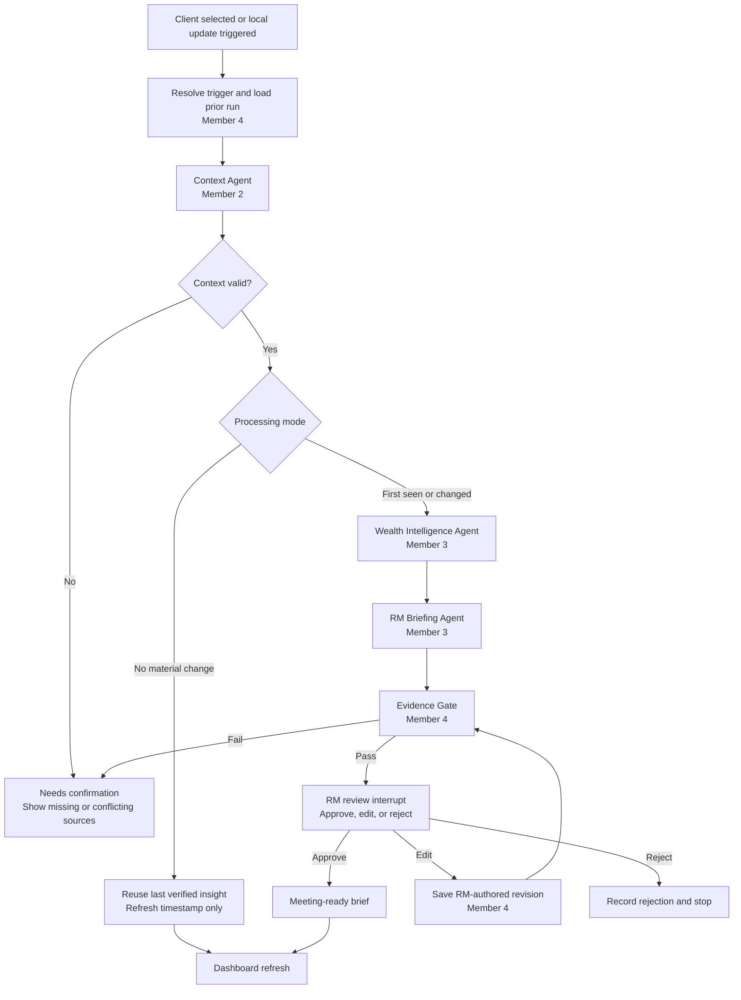
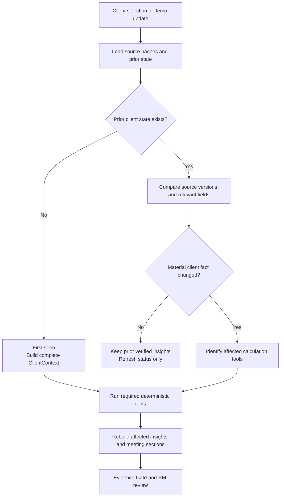
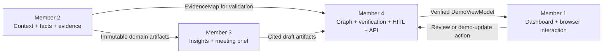

# PRD: Client Future Room — Two-Day Hackathon

## Document status

| Field | Decision |
| --- | --- |
| Product | Client Future Room |
| Format | React RM dashboard using Fluent UI with a Teams-inspired visual style |
| Build window | Two-day hackathon |
| Primary user | Relationship Manager (RM) |
| Primary demo client | Margarethe Voss-Brenner, `CL-0003` |
| Core deliverable | Explainable client-data-to-insight pipeline demonstrated through one meeting workflow |
| Team size | Four people |

## 1. Product statement

Client Future Room is a simple but comprehensive RM dashboard. It helps an RM select a client,
understand what changed, inspect important portfolio and relationship insights, and prepare for the
next client meeting.

The React interface uses Fluent UI to borrow the familiar visual language of Microsoft Teams,
including a left navigation rail and a compact upcoming-meetings calendar. It is not a Teams
platform and it is not a calendar application. The dashboard and selected-client intelligence are
the product.

The project is a two-day proof of concept. Its purpose is to demonstrate:

1. An intuitive way for an RM to move between clients and meetings.
2. An explainable agent pipeline that turns supplied data into client-specific insights.
3. A human-in-the-loop review before generated content becomes meeting-ready.
4. One deep client story rather than production coverage of every possible workflow.

## 2. Fit with the challenge mission

The README asks teams to build the intelligence layer between portfolio data and the Relationship
Manager. This product directly follows that mission:

`signal -> client-specific understanding -> possible action -> RM review -> client conversation`

| Challenge requirement | Hackathon response |
| --- | --- |
| Intelligent portfolio explanation | Explain what changed across dated snapshots and connect the change to the selected client's holdings |
| Proactive risk and opportunity detection | Surface the most important mandate, concentration, liquidity, collateral, event, or life-goal discrepancy |
| RM Intelligence Workbench | Turn verified insights into a concise meeting brief and suggested questions |
| Personalization | Connect portfolio facts to risk profile, objectives, life stage, cash needs, reporting language, and prior RM notes |
| Explainability | Show the calculation, source rows, assumptions, confidence, and as-of date behind every insight |
| Human oversight | Require the RM to approve, edit, or reject meeting-ready output |
| Time dimension | Compare the five snapshots instead of treating the portfolio as static |
| Event governance | Use `event_log.csv` as the authoritative source for 2026 events |

The demo intentionally goes deep on one client, as encouraged by the README. The interface can show
other clients in the switcher, but the judged pipeline and meeting story are optimized for
Margarethe Voss-Brenner.

## 3. Primary demo story

### Client

Margarethe Voss-Brenner is the primary use case because her data creates a clear, personal, and
defensible RM conversation:

- She described herself as someone who has never taken a risk with money.
- Her risk profile is Conservative.
- Her current portfolio has 71.5% in equity against a 30% mandate maximum.
- She has an approaching EUR 3.4 million inheritance-tax cash need.
- She asked for something “safe and boring.”
- Her reporting language is German.

This is stronger than a generic portfolio alert because it connects:

`client statement + mandate rule + current allocation + cash deadline -> meeting conversation`

### Demonstrated update

The same client also demonstrates how the pipeline handles change:

1. The first run builds her context from all data available up to the selected as-of date.
2. A controlled update introduces a newer RM interaction or portfolio snapshot.
3. The pipeline identifies which facts changed.
4. The agents regenerate only the affected insights and meeting sections.
5. The UI labels the new insight and retains the prior version for comparison.

The update is driven by a local fixture or existing dated record. It does not require a live CRM,
email, calendar, or market-data integration.

## 4. Goals

### Must achieve

- Present a polished RM dashboard that is understandable without explanation.
- Include a compact calendar/upcoming-meetings component without making calendar management the
  main product.
- Let the RM switch clients while keeping the same dashboard structure.
- Show a comprehensive summary for the selected client.
- Surface no more than three high-value insights.
- Show what changed and why it matters to the client.
- Generate a focused meeting brief with discussion topics, questions, and uncertainty.
- Make the full data-to-insight trail inspectable.
- Demonstrate first-time processing and one incremental update.
- Include RM approve, edit, and reject decisions.
- Work reliably without external services during judging.

### Nice to have

- Natural-language retrieval over the selected client's RM notes.
- A precomputed scenario range.
- A lightweight update animation or in-app notification.
- Output in the client's reporting language with an English explanation for the RM.

### Explicit non-goals

- Building a complete Microsoft Teams experience.
- Recreating Microsoft Teams pixel for pixel instead of using Fluent UI as a coherent design
  system.
- Building a calendar-management product.
- Live Microsoft Graph, CRM, email, meeting, or banking-system integration.
- Production authentication, permissions, queues, event buses, or data warehouses.
- Production-grade long-term memory infrastructure.
- Autonomous client contact, recommendations, trades, or write-backs.
- Broad and equally deep analysis for all 20 clients.
- A generic chat assistant.
- An LLM performing financial calculations or inventing market events.

## 5. Main interface

### Design goal

The main interface should feel calm, fast, and comprehensive. The RM should be able to understand
the selected client's next conversation without moving through many pages.

The frontend is implemented in React and TypeScript with Fluent UI React v9. A root
`FluentProvider` supplies a Teams-style theme, and Fluent design tokens and components should be
used before adding custom visual primitives. Custom CSS is limited to the dashboard layout,
financial visualizations, and behavior Fluent UI does not supply.

### Layout

~~~text
┌────────────────┬─────────────────────────────────────────────────────────────┐
│ Client switch  │ RM dashboard                                                │
│                │                                                             │
│ Search         │ Client header + next meeting + last refresh                 │
│ Client list    │                                                             │
│                │ Top insights / discrepancies                                │
│                │                                                             │
│                │ What changed        Meeting brief       Compact calendar    │
│                │                                                             │
│                │ Overview | Insights | Data | Memory                         │
└────────────────┴─────────────────────────────────────────────────────────────┘
~~~

### 5.1 Client switcher

- Persistent left-side list or search control.
- Shows client name, next meeting, and a small attention state.
- Selecting a client updates the entire dashboard in place.
- Other clients may use lighter precomputed summaries; only the primary client requires full demo
  depth.

### 5.2 Dashboard header

- Selected client name and essential profile.
- Next meeting date and purpose.
- Last data refresh and insight-generation time.
- Data-health state: `Current`, `Updating`, `Needs confirmation`, or `Stale`.
- One primary action: open or review the meeting brief.

### 5.3 Compact calendar

- Shows the RM's upcoming client meetings for the current week or next two weeks.
- Highlights the selected client's meeting.
- Indicates whether a meeting brief is `Ready`, `Needs review`, or `Not prepared`.
- Selecting a meeting switches the selected client and opens the relevant brief.
- Does not create, edit, reschedule, or synchronize meetings in the MVP.

### 5.4 Top insights

Show no more than three insights. Each card contains:

- What changed.
- Why it matters to this client.
- Severity or urgency.
- Confidence and uncertainty.
- Suggested topic or question for the RM.
- `Why?` action opening the evidence trail.
- `New`, `Changed`, or `Unchanged` state after an update.

### 5.5 Meeting brief

The brief contains:

- Two-minute client summary.
- Three discussion topics.
- `You said / Data says` discrepancy.
- Changes since the last interaction or snapshot.
- Open commitments and follow-ups.
- Suggested questions.
- One clear uncertainty or item to confirm.
- Optional client-language opening.
- Approve, edit, or reject controls.

### 5.6 Insights, data, and memory

The lower dashboard uses simple tabs:

- **Overview:** current client and portfolio summary.
- **Insights:** active and recently changed insight cards.
- **Data:** allocation, snapshot changes, mandate, liquidity, cash need, collateral, and evidence.
- **Memory:** chronological RM notes and extracted beliefs, preferences, promises, and concerns.

No chart or metric should appear unless it helps explain an active insight or meeting topic.

### 5.7 Evidence drawer

The evidence drawer is the core explainability interaction. It shows:

- The generated claim.
- The deterministic fact or discrepancy supporting it.
- Calculation inputs and result.
- Exact source file, row identifier, and fields.
- Relevant RM-note span.
- Matched authoritative event, if applicable.
- Confidence, uncertainty, and as-of date.
- Whether the content was generated, edited by the RM, or approved by the RM.

The drawer shows evidence and tool results, not private chain-of-thought.

## 6. Simplified agent pipeline

### Design decision

Use three broad agents instead of many narrow graph nodes. Each agent owns a meaningful stage and
can call several constrained tools. Deterministic tools perform calculations; agents select,
connect, and explain the results.

The graph adds value through explicit state, inspectable intermediate artifacts, conditional
routing, and the human review interrupt. It should not become a complex multi-agent simulation.

### 6.1 Runtime execution graph

The graph has only three agent nodes. Trigger resolution, evidence validation, persistence, and the
human interrupt are deterministic control nodes. This keeps the system easy to explain without
hiding important branches.

### 6.2 Context Agent

**Owner:** Member 2.

**Responsibility:** Build the smallest complete and current context needed to analyze the selected
client.

**Tools:**

- Client/profile loader.
- Portfolio and holdings loader.
- As-of snapshot selector.
- Transactions and cash-needs loader.
- Mandate and credit-facility loader.
- RM-note loader returning raw, cited source records only.
- Source-version and change detector.
- Data-quality validator.

**Outputs:**

- `ClientContext`.
- Source and as-of coverage.
- New, changed, missing, stale, or conflicting records.
- Cited RM-note source records; no extracted beliefs or memory conclusions.
- A processing mode: `first_seen`, `incremental_update`, or `no_material_change`.

**Behavior by case:**

- **First seen:** load and validate all available client history.
- **Update:** compare source versions and identify affected fact families.
- **No material change:** preserve existing insights and update freshness only.
- **Missing/conflicting data:** preserve both records and flag what needs confirmation.

### 6.3 Wealth Intelligence Agent

**Owner:** Member 3. Member 3 may call Member 2's calculation tools but may not modify or duplicate
their formulas inside the agent.

**Responsibility:** Turn client context into verified facts, discrepancies, and ranked insight
candidates.

**Inputs:** `ClientContext` plus Member 2's immutable calculation tools and fact/evidence schemas.

**Tools:**

- Transaction-aware performance attribution.
- Mandate checker.
- Household and structured-product look-through concentration calculator.
- Liquidity, commitment, and planned-cash-need calculator.
- Collateral and LTV calculator.
- Currency exposure calculator.
- Authoritative event-to-exposure matcher.
- Scenario-range calculator.
- Client-statement-versus-data discrepancy matcher.
- Deterministic priority scorer.

**Outputs:**

- `InsightBundle` referencing the immutable `FactBundle` and evidence IDs returned by Member 2's
  tools.
- Extracted memory items and candidate discrepancies.
- No more than three ranked insights with deterministic score components.
- Explicit assumptions and confidence.

The agent never invents a value or performs arithmetic in free-form text. It chooses and connects
outputs from deterministic tools.

### 6.4 RM Briefing Agent

**Owner:** Member 3.

**Responsibility:** Convert the selected insights into a concise, client-specific meeting brief.

**Tools:**

- Ranked-fact selector.
- Client-memory search.
- Prior-meeting and open-follow-up retriever.
- Controlled event-summary retriever.
- Meeting-topic template.
- Suggested-question template.
- Reporting-language formatter.
- Claim-to-evidence linker.

**Outputs:**

- Two-minute summary.
- Three discussion topics.
- `You said / Data says` comparison.
- Suggested questions and next checks.
- One uncertainty statement.
- Optional client-language opening.
- Claim-level citations.

The briefing agent receives structured facts and cited memory, not unrestricted raw data.

### 6.5 Evidence Gate

**Owner:** Member 4.

The gate is a deterministic validation node, with an optional second model used only as a critic.
It checks:

- Every number exactly matches a fact.
- Every factual sentence has at least one evidence reference.
- Every evidence reference resolves to a source record.
- No event outside `event_log.csv` is presented as fact.
- No data after the selected as-of time is used.
- Stale, missing, lagged, or conflicting data is disclosed.
- The brief suggests topics and questions rather than presenting autonomous advice.
- Required scenario and uncertainty disclaimers are present.

A failed brief routes to `Needs confirmation`; it does not automatically regenerate in a loop.

### 6.6 Human-in-the-loop review

**Owner:** Member 4 for graph state and persistence; the RM owns the decision.

After the evidence gate passes, the LangGraph run pauses for RM review.

- **Approve:** mark the brief meeting-ready.
- **Edit:** save the RM-authored revision, rerun the evidence gate, and preserve both versions.
- **Reject:** retain the rejection and reason for audit and demo evaluation.

No client-ready output is final before this step. The UI should visibly distinguish:

- Agent-generated text.
- Verified text.
- RM-edited text.
- RM-approved text.

## 7. Explainable state and artifacts

Member 4 owns the graph-state schema and reducers. Other members return typed updates through their
contracts; they do not mutate or persist graph state directly.

Keep the graph state small and serializable:

~~~text
run_id
client_id
as_of
trigger_type
client_context
changed_sources
memory_items
tool_runs
fact_bundle
ranked_insights
meeting_brief
evidence_map
verification_result
rm_review
status
~~~

Each `tool_runs` entry records the tool name, input evidence IDs, output fact IDs, calculation or
prompt version, completion status, and error category. This provides an explainable execution trace
without exposing hidden chain-of-thought.

### Evidence and artifact lineage

```mermaid
flowchart LR
    A[Source rows and RM notes] --> B[Context Agent<br/>Member 2]
    B -->|ClientContext| C[Deterministic calculation tools<br/>Member 2]
    C -->|FactBundle + EvidenceMap| D[Wealth Intelligence Agent<br/>Member 3]
    D -->|InsightBundle| E[RM Briefing Agent<br/>Member 3]
    E -->|MeetingBrief| F[Evidence Gate<br/>Member 4]
    F -->|VerificationReport + VerifiedBrief| G[RM decision]
    G -->|ReviewRecord| H[DemoViewModel<br/>Member 4]
    H --> I[Dashboard rendering<br/>Member 1]
```

Every arrow is a typed handoff. The receiving member may read the artifact but cannot silently
change the upstream facts, evidence, or generated claims.

Each stage produces an artifact the UI can inspect and one member owns:

| Artifact | Single owner | Inspectable content | Consumers |
| --- | --- | --- | --- |
| `ClientContext` | Member 2 | Source coverage, changed records, as-of scope, and cited raw RM notes | Members 3 and 4 |
| `FactBundle` and `EvidenceMap` | Member 2 | Calculations, discrepancies, inputs, and exact evidence IDs | Members 3 and 4 |
| `InsightBundle` | Member 3 | Selected insights, ranking components, fact IDs, and uncertainty | Member 4 |
| `MeetingBrief` | Member 3 | Claim-level cited summary, questions, and meeting topics | Member 4 |
| `VerificationReport` and reviewed versions | Member 4 | Pass/fail checks, reasons, and RM decision | Member 1 |
| `DemoViewModel` | Member 4 | Only verified dashboard-ready data and allowed UI actions | Member 1 |
| Visible UI state | Member 1 | Selection, open tab/drawer, loading state, and form input | Browser only |

Explainability means showing provenance, calculations, assumptions, confidence, and review status.
It does not require exposing hidden model reasoning.

## 8. Update behavior for the demo

The two-day build needs only three clear processing modes:

Member 2 owns source comparison and the resulting change description. Member 4 owns the graph edge
chosen from that result. Member 3 does not decide whether data changed; it regenerates the insight
content requested by the selected route.

| Mode | Trigger | Pipeline behavior | UI behavior |
| --- | --- | --- | --- |
| First seen | No prior client state | Load all available history, compute all facts, create initial brief | Show `Initial analysis` and source coverage |
| Incremental update | New note, holding snapshot, transaction, or profile field | Identify changed sources, rerun affected tools, replace changed insights | Show before/after state and `New` or `Changed` labels |
| No material change | New input does not change a relevant fact | Update freshness and retain prior verified insight | Show `No material change`; create no alert |

For judging, updates are simulated with a deterministic local fixture or a supplied dated record.
There is no need for background agents, streaming connectors, or continuous external polling.

## 9. Minimal technical implementation

Reuse the existing project:

- Python and pandas for data loading and deterministic tools.
- FastAPI for serving the app and three small API actions.
- React and TypeScript for the dashboard application.
- Vite for the two-day frontend development and production build workflow.
- Fluent UI React v9 through `@fluentui/react-components`.
- `FluentProvider` with a Teams-style Fluent theme and Fluent design tokens for consistent color,
  spacing, typography, focus, and interaction states.
- Fluent UI icons through `@fluentui/react-icons` rather than a second icon system.
- LangGraph in process for the three agents, evidence gate, and RM review pause.
- Generated JSON for graph artifacts and the last verified client state.
- JSON review log for approve, edit, and reject records.
- Cached or deterministic narration fallback so the demo does not depend on live model availability.

The React production build is served by FastAPI for the final demo. The development server may
proxy `/api` requests to FastAPI during implementation.

### Minimal API surface

- `GET /api/app` — dashboard, client switcher, compact calendar, selected-client brief, insights,
  data, memory, and evidence.
- `POST /api/demo/update` — apply or reset the controlled client update.
- `POST /api/reviews` — approve, edit, or reject the current brief.

### Explicitly deferred

- Database migration.
- External connectors.
- Enterprise authentication.
- Production scheduling and notification infrastructure.
- Durable distributed checkpoints.
- Multiple RMs, teams, or entitlements.
- Production monitoring and deployment architecture.

## 10. Four-person team plan

The four roles are organized around one vertical demo. Members 2, 3, and 4 all focus on distinct
parts of the data-to-insight pipeline; Member 1 makes those artifacts understandable in the UI.

| Member | Owns | Final handoff |
| --- | --- | --- |
| Member 1 — Dashboard and UX | Rendering and browser-only interaction state | Renders the verified `DemoViewModel` and emits user actions to Member 4's API |
| Member 2 — Context and calculation tools | Source data, Context Agent, deterministic facts, and evidence | Produces immutable `ClientContext`, `FactBundle`, and `EvidenceMap` artifacts |
| Member 3 — Insight and briefing agents | Wealth Intelligence Agent and RM Briefing Agent | Produces cited `InsightBundle` and `MeetingBrief` artifacts for Member 4 |
| Member 4 — Graph, explainability, and HITL | Graph topology, routing, verification, review state, minimal API, and integration | Produces verified versions, `DemoViewModel`, and end-to-end behavior |

### Member 1 — Dashboard and UX

**Primary objective:** Deliver the simple, comprehensive RM experience.

**Owns:**

- Dashboard shell and Teams-inspired visual styling.
- React application structure, TypeScript view models, and client-side API hooks.
- Root `FluentProvider`, Fluent theme selection, and shared design tokens.
- Fluent UI components for navigation, cards, tabs, buttons, badges, drawers/dialogs, forms,
  loading states, and accessible feedback.
- Client switcher.
- Compact upcoming-meetings calendar.
- Client header and summary.
- Top insight/discrepancy cards.
- Overview, Insights, Data, and Memory tabs.
- Evidence drawer.
- Approve, edit, reject, update, loading, and error states.
- Responsive behavior and demo polish.

**Does not own:** financial calculations, graph routing, citation validation, or persistence.

**Primary file boundary:** proposed `frontend/src/`, `frontend/package.json`, Vite configuration,
and frontend component tests. FastAPI serves the generated `frontend/dist/`, which is build output
and not edited manually.

**Definition of done:** The complete demo can be understood by following the interface without a
verbal explanation of where to click.

### Member 2 — Data and calculation tools

**Primary objective:** Make the selected client's facts correct and defensible.

**Owns:**

- Loaders and joins for the selected client.
- As-of filtering and source references.
- First-seen and updated context comparison.
- Transaction-aware change calculation.
- Mandate gap.
- Household and structured-product look-through concentration.
- Liquidity versus the inheritance-tax cash need.
- Optional event or scenario calculation.
- Typed `ClientContext`, `Fact`, and `EvidenceRef` outputs.
- Unit tests for every displayed number.
- The Context Agent node implementation and its tool calls.

**Does not own:** insight selection, prose generation, graph routing, UI components, or review
actions.

**Primary file boundary:** proposed `app/context.py`, `app/analytics.py`, shared fact/evidence
models, and `tests/test_facts.py`.

**Definition of done:** Every number shown in the demo resolves to a repeatable calculation and
exact source rows.

### Member 3 — Insight and briefing agents

**Primary objective:** Turn the verified facts into a small number of useful RM insights.

**Owns:**

- Wealth Intelligence Agent node implementation.
- RM Briefing Agent node implementation.
- Tool-use instructions and structured-output schemas for those two agents.
- Memory extraction from RM notes.
- Discrepancy matching between client statements and facts.
- Candidate selection, deduplication, and deterministic ranking.
- Meeting-summary and question templates.
- Optional model prompts and structured outputs.
- Claim-to-evidence links before verification.
- Golden expected output for Margarethe.

**Does not own:** the Context Agent, underlying financial formulas, LangGraph topology or routing,
evidence-gate decisions, frontend rendering, or API/storage infrastructure.

**Primary file boundary:** proposed `app/insight_agents.py`, prompt/templates, and
`tests/test_insights.py`.

**Definition of done:** One graph invocation produces no more than three relevant, cited insights
and a concise meeting brief from Member 2's facts.

### Member 4 — Graph, explainability, HITL, and integration

**Primary objective:** Make the pipeline inspectable, reviewable, and reliable from end to end.

**Owns:**

- Evidence Gate implementation.
- Claim/number/citation resolution.
- LangGraph state, graph construction, reducers, and conditional edges.
- First-seen, incremental-update, no-material-change, verification-failure, edit, approve, and
  reject routing.
- Human review pause and approve/edit/reject resume behavior.
- Version comparison between the initial and updated brief.
- Minimal FastAPI wiring and generated JSON/review-log storage.
- `GET /api/app`, `POST /api/demo/update`, and `POST /api/reviews`.
- End-to-end tests and deterministic fallback artifacts.
- Demo seed/reset command and final integration.

**Does not own:** new product screens, source comparison logic, financial formulas, memory
extraction, insight selection, or primary narrative prompts.

**Primary file boundary:** proposed `app/graph.py`, `app/verification.py`, `app/main.py`, generated
artifacts/review log, `tests/test_graph.py`, and `tests/test_api.py`.

**Definition of done:** The demo can run from a clean start, show the initial insight, apply one
update, explain every claim, pause for RM review, resume correctly, and recover through a
deterministic fallback if a model call fails.

### Ownership handoff graph

### Frozen handoff contracts

The team freezes these five contracts before parallel work:

1. `ClientContext` — Member 2 to Members 3 and 4.
2. `FactBundle` and `EvidenceMap` — Member 2 to Members 3 and 4.
3. `InsightBundle` and `MeetingBrief` — Member 3 to Member 4 only.
4. `VerificationReport` and `DemoViewModel` — Member 4 to Member 1.
5. Review and demo-update actions — Member 1 sends; Member 4 defines and processes.

No member should reimplement another member's calculations or state transformations inside their
own layer.

### No-overlap rules

- Member 1 never calculates, ranks, verifies, or repairs pipeline data in React or TypeScript.
- Member 2 never selects final insights or writes meeting prose.
- Member 2 owns calculation-tool interfaces and formulas; Member 3 may only invoke tools from that
  published registry.
- Member 3 treats Member 2's facts as immutable and never reads pandas/CSV sources directly.
- Member 4 routes and verifies artifacts but never changes fact formulas or rewrites prompts.
- Only Member 4 compiles the LangGraph and persists run/review state.
- Only Member 1 owns the visible layout and browser-selection behavior.
- Tests follow the same boundary: UI tests belong to Member 1, fact tests to Member 2, golden
  insight tests to Member 3, and graph/API/end-to-end tests to Member 4.

## 11. Two-day execution plan

### Day 1 morning — Freeze the vertical slice

- Confirm Margarethe as the only deep pipeline use case.
- Freeze the initial and updated data states.
- Freeze the four handoff contracts.
- Sketch the single dashboard and evidence drawer.
- Agree on the expected top three insights and meeting brief.

### Day 1 afternoon — Build in parallel

- Member 1 builds the dashboard from a frozen `DemoViewModel`.
- Member 2 builds and tests client context and calculation tools.
- Member 3 builds the Wealth Intelligence and RM Briefing node functions with fixture facts, then
  tests them against Member 2's frozen output contracts.
- Member 4 compiles the LangGraph, connects its routes, and builds verification, review state, and
  minimal API fixtures.

### End of Day 1 — Vertical integration

- Selected client loads.
- At least one verified insight appears.
- Evidence drawer resolves its sources.
- Approve/edit/reject works against a fixture brief.

### Day 2 morning — Complete the story

- Connect all three insights and the meeting brief.
- Connect the compact calendar and client switcher.
- Member 2 completes first-seen and incremental change detection; Member 4 connects the resulting
  graph routes.
- Connect the Evidence Gate and human-review pause.
- Confirm the updated brief supersedes the initial version.

### Day 2 afternoon — Harden and rehearse

- Run calculation, citation, graph-routing, and end-to-end tests.
- Confirm the demo works without network access or a live model.
- Polish empty, loading, stale, and error states.
- Rehearse the three-minute product demo and technical explanation.
- Freeze data and keep a one-click reset.

## 12. Acceptance criteria

### Interface

- The first screen is clearly an RM dashboard, not a calendar product.
- The frontend is a React and TypeScript application using Fluent UI React v9.
- A root `FluentProvider` supplies the Teams-inspired theme; Fluent tokens and components are reused
  instead of maintaining a parallel hand-built component system.
- The compact calendar helps choose an upcoming client conversation.
- The client switcher updates the selected client without changing the app structure.
- The primary client summary, top insights, and meeting brief are visible within one interaction.
- No more than three insights compete for attention.
- Client switching, tabs, the evidence drawer, and review controls are keyboard accessible and keep
  visible focus.

### Pipeline

- The initial run and one update run are both demonstrable.
- Each agent has a clear responsibility and can call multiple constrained tools.
- Deterministic tools calculate every displayed number.
- The graph state and outputs can be inspected at each major stage.
- A no-material-change input does not create a new alert.
- Failed verification cannot reach RM approval.

### Explainability and HITL

- Every generated factual claim has a citation.
- Every citation resolves to an exact source record.
- Every insight shows why it matters to Margarethe, not just what changed.
- Uncertainty and stale or missing data are visible.
- The RM can approve, edit, or reject the brief.
- Edited text is rechecked and stored as an RM-authored version.
- No client-ready output becomes final without RM approval.

### Mission fit

- The demo explains a temporal portfolio change or current discrepancy.
- The insight incorporates mandate, risk profile, objective or cash need, and RM-note context.
- The experience moves visibly from signal to understanding to reviewed meeting action.
- The RM remains responsible for the final conversation.
- The demo acknowledges data imperfections rather than hiding them.

### Reliability

- The complete path works locally without external connectors.
- A deterministic fallback brief is available if the model is unavailable.
- Tests cover the displayed calculations, citation resolution, graph routes, and review actions.
- The demo can reset to its initial state in one action.

## 13. Three-minute demo

1. Open the RM dashboard and orient the judge to the selected client, next meeting, and compact
   calendar.
2. Show Margarethe's top discrepancy: her low-risk self-description versus 71.5% equity against a
   30% limit.
3. Open `Why?` and show the exact RM note, holdings, mandate row, calculation, and as-of date.
4. Show how the EUR 3.4 million tax need changes the importance and timing of the conversation.
5. Open the meeting brief and show three topics, suggested questions, and one uncertainty.
6. Apply the controlled update and show which insight or wording changed and which facts did not.
7. Edit or approve the suggested German opening through the human-review step.
8. End on the value proposition: verified portfolio facts became a timely, personalized,
   RM-controlled client conversation.

## 14. Final scope rule

If a feature does not improve the single path below, it is out of scope for the two-day build:

`select client -> understand discrepancy -> inspect evidence -> prepare meeting -> review output`
