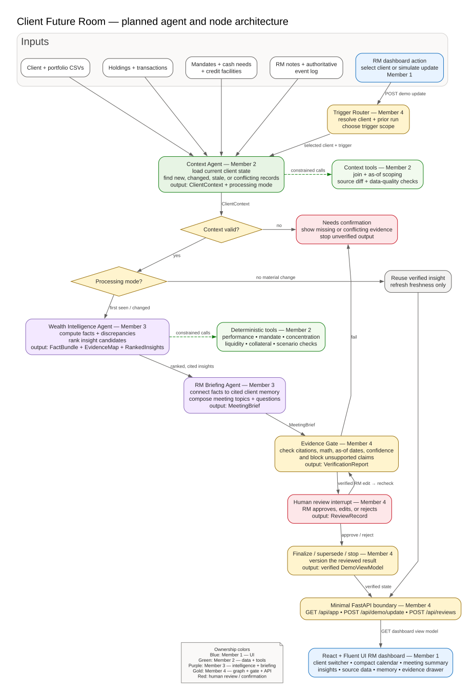
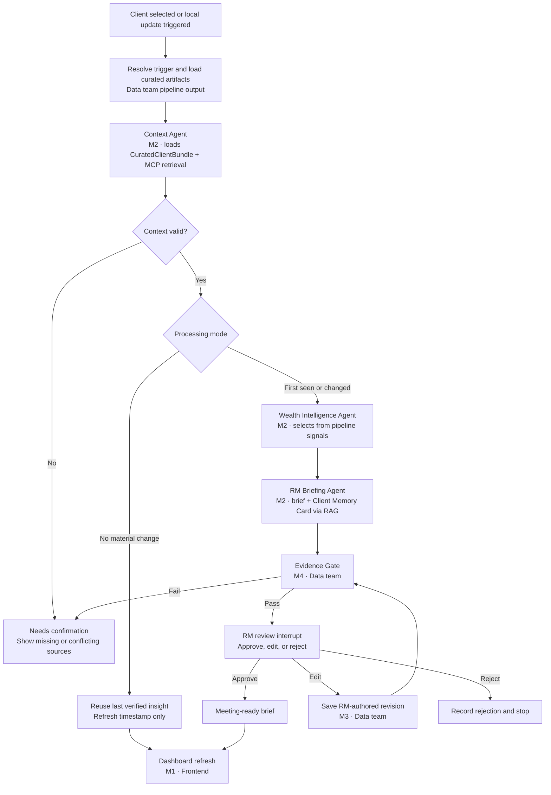
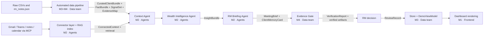
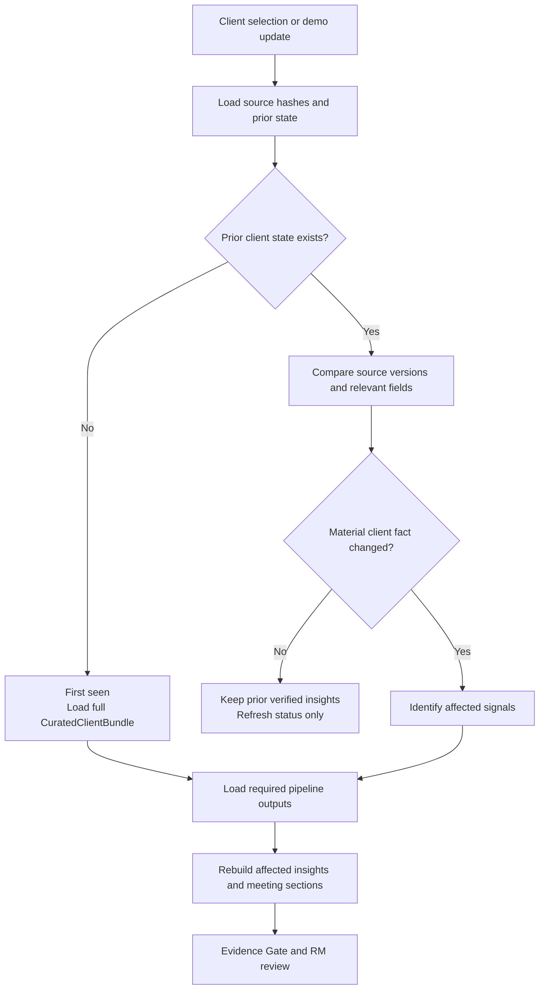
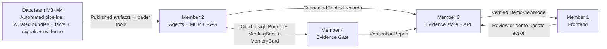

# PRD: Client Future Room — Two-Day Hackathon

## Document status

| Field | Decision |
| --- | --- |
| Product | Client Future Room |
| Format | React RM dashboard using Fluent UI with a Teams-inspired visual style |
| Build window | Two-day hackathon |
| Primary user | Relationship Manager (RM) |
| Primary demo client | Margarethe Voss-Brenner, `CL-0003` |
| Core deliverable | Automated data pipeline + explainable agent layer demonstrated through one meeting workflow |
| Team size | Four people: 1 frontend · 1 agents + external MCPs (RAG) · 2 data (pipeline + analysis) |

### Current integration checkpoint

The CLI now uses SQLite for persistent interactions, graph checkpoints, pack history, and Review
Decisions. A read-only local MCP server exposes dated Curated Client Bundles, communication context,
and cited memory search over stdio or Streamable HTTP. The graph can consume those live protocol
responses; dataset/imported records remain labelled Cached, not live external account data.
See [run and demo instructions](PERSISTENT_MEMORY_MCP.md). Optional read-only Gmail, Outlook Mail,
Google Calendar and Outlook Calendar adapters, OAuth setup commands and atomic cached snapshots
are implemented. See [account setup](CONNECT_GOOGLE_OUTLOOK.md). Provider behavior is tested with
mocked responses; actual demo-account consent and a successful live read are still required before
claiming the external-retrieval stretch goal. Teams access, background synchronization and the new
dashboard API remain deferred. The judged path stays deterministic and offline-capable.
Team ownership below remains unchanged; later Teams references describe planned/fixture behavior.

## 1. Product statement

Client Future Room is a simple but comprehensive RM dashboard. It helps an RM select a client,
understand what changed, inspect important portfolio and relationship insights, remember who the
client is as a person, and prepare for the next client meeting.

The React interface uses Fluent UI to borrow the familiar visual language of Microsoft Teams,
including a left navigation rail and a compact upcoming-meetings calendar. It is not a Teams
platform and it is not a calendar application. The dashboard and selected-client intelligence are
the product.

The project is a two-day proof of concept. Its purpose is to demonstrate:

1. An intuitive way for an RM to move between clients and meetings.
2. An automated data pipeline that turns the raw dataset into curated, signal-rich artifacts.
3. An explainable agent layer that turns those artifacts into client-specific insights.
4. A RAG-backed **Client Memory Card**: the agent fetches RM↔client emails, Teams messages, and
   notes through MCP connectors and condenses them into a one-glance "remember this client" note
   with advice for the next conversation — context that does not exist in the structured data.
5. A human-in-the-loop review before generated content becomes meeting-ready.
6. One deep client story rather than production coverage of every possible workflow.

## 2. Fit with the challenge mission

The README asks teams to build the intelligence layer between portfolio data and the Relationship
Manager. This product directly follows that mission:

`signal -> client-specific understanding -> possible action -> RM review -> client conversation`

| Challenge requirement | Hackathon response |
| --- | --- |
| Intelligent portfolio explanation | Explain what changed across dated snapshots and connect the change to the selected client's holdings |
| Proactive risk and opportunity detection | The data pipeline extracts mandate, concentration, liquidity, collateral, event, and life-goal signals before any agent runs |
| RM Intelligence Workbench | Turn verified insights into a concise meeting brief and suggested questions |
| Personalization | The Client Memory Card recalls personality, preferences, needs, and recent interactions from emails, Teams messages, and notes |
| Explainability | Show the calculation, source rows, assumptions, confidence, and as-of date behind every insight |
| Human oversight | Require the RM to approve, edit, or reject meeting-ready output |
| Time dimension | Compare the five snapshots instead of treating the portfolio as static |
| Event governance | Use `event_log.csv` as the authoritative source for 2026 events |
| Realistic integration story | Read-only MCP connectors (Gmail, Teams, notes, calendar) show how the workbench sits inside the RM's real toolchain |

The demo intentionally goes deep on one client, as encouraged by the README. The interface can show
other clients in the switcher, but the judged pipeline and meeting story are optimized for
Margarethe Voss-Brenner.

## 3. Primary demo story

### Client

Margarethe Voss-Brenner is the primary use case because her data creates a clear, personal, and
defensible RM conversation:

- She described herself as someone who has never taken a risk with money.
- Her risk profile is Conservative.
- Her current portfolio has 71.5% in equity against a 30% mandate maximum.
- She has an approaching EUR 3.4 million inheritance-tax cash need.
- She asked for something “safe and boring.”
- Her reporting language is German.

This is stronger than a generic portfolio alert because it connects:

`client statement + mandate rule + current allocation + cash deadline -> meeting conversation`

### Demonstrated update

The same client also demonstrates how the pipeline handles change:

1. The first run builds her context from all data available up to the selected as-of date.
2. A controlled update introduces a newer RM interaction or portfolio snapshot.
3. The pipeline identifies which facts changed.
4. The agents regenerate only the affected insights and meeting sections.
5. The UI labels the new insight and retains the prior version for comparison.

The update is driven by a local fixture or existing dated record. It does not require a live CRM
or banking-system integration.

### Client memory (RAG over connected sources)

The structured dataset says what Margarethe *holds*. It does not say who she *is*. That context
lives in the RM's scattered communication history — emails, Teams messages, meeting notes. The
demo shows the agent recovering it:

1. MCP connectors fetch the RM↔client email threads, Teams messages, notes, and calendar entries
   that mention the selected client.
2. The records are normalized, chunked, and embedded into a per-client retrieval index.
3. At briefing time, the agent retrieves the most relevant passages by topic — recent updates,
   personality and communication style, stated needs, promises made.
4. The result is a **Client Memory Card**: a one-glance remember note plus advice notes for the
   next conversation, every line cited to the exact email, message, or note it came from.

All connector reads are recorded as fixtures so the judged demo replays them without network
access. Every connector-derived item shows its source, retrieval time, and live/cached state —
the UI never implies a connector was queried when it was not.

## 4. Goals

### Must achieve

- Present a polished RM dashboard that is understandable without explanation.
- Include a compact calendar/upcoming-meetings component without making calendar management the
  main product.
- Let the RM switch clients while keeping the same dashboard structure.
- Show a comprehensive summary for the selected client.
- Run the automated data pipeline from raw files to curated artifacts with one command.
- Surface no more than three high-value insights, each traceable to a pipeline-detected signal.
- Show what changed and why it matters to the client.
- Generate a focused meeting brief with discussion topics, questions, and uncertainty.
- Generate the Client Memory Card from MCP-retrieved communication history via RAG, with recorded
  fixtures so judging never depends on the network.
- Make the full data-to-insight trail inspectable.
- Demonstrate first-time processing and one incremental update.
- Include RM approve, edit, and reject decisions.
- Work reliably without external services during judging.

### Nice to have

- Natural-language retrieval over the selected client's full communication history.
- A precomputed scenario range.
- A lightweight update animation or in-app notification.
- Output in the client's reporting language with an English explanation for the RM.
- One live (non-fixture) MCP retrieval demonstrated outside the judged path.
- Exploratory visualizations from the data-analysis phase reused as presentation material.

### Explicit non-goals

- Building a complete Microsoft Teams experience.
- Recreating Microsoft Teams pixel for pixel instead of using Fluent UI as a coherent design
  system.
- Building a calendar-management product.
- **Writing** to any external system: no sending email, creating events, posting messages, or
  editing notes. All MCP connectors are read-only.
- Live CRM or banking-system integration.
- Production authentication, permissions, queues, event buses, or data warehouses.
- A production vector database or long-term memory infrastructure — the RAG index is local and
  rebuilt from fixtures.
- Autonomous client contact, recommendations, trades, or write-backs.
- Broad and equally deep analysis for all 20 clients.
- A generic chat assistant.
- An LLM performing financial calculations or inventing market events. Numbers come only from the
  data pipeline; RAG supplies qualitative context, never figures.

## 5. Main interface

### Design goal

The main interface should feel calm, fast, and comprehensive. The RM should be able to understand
the selected client's next conversation without moving through many pages.

The frontend is implemented in React and TypeScript with Fluent UI React v9. A root
`FluentProvider` supplies a Teams-style theme, and Fluent design tokens and components should be
used before adding custom visual primitives. Custom CSS is limited to the dashboard layout,
financial visualizations, and behavior Fluent UI does not supply.

### Layout

~~~text
┌────────────────┬─────────────────────────────────────────────────────────────┐
│ Client switch  │ RM dashboard                                                │
│                │                                                             │
│ Search         │ Client header + next meeting + last refresh                 │
│ Client list    │                                                             │
│                │ Top insights / discrepancies                                │
│                │                                                             │
│                │ What changed        Meeting brief       Compact calendar    │
│                │                                                             │
│                │ Client Memory Card (RAG: email · Teams · notes)             │
│                │                                                             │
│                │ Overview | Insights | Data | Memory                         │
└────────────────┴─────────────────────────────────────────────────────────────┘
~~~

### 5.1 Client switcher

- Persistent left-side list or search control.
- Shows client name, next meeting, and a small attention state.
- Selecting a client updates the entire dashboard in place.
- Other clients may use lighter precomputed summaries; only the primary client requires full demo
  depth.

### 5.2 Dashboard header

- Selected client name and essential profile.
- Next meeting date and purpose.
- Last data refresh and insight-generation time.
- Data-health state: `Current`, `Updating`, `Needs confirmation`, or `Stale`.
- One primary action: open or review the meeting brief.

### 5.3 Compact calendar

- Shows the RM's upcoming client meetings for the current week or next two weeks.
- Meeting entries come from the calendar MCP fixture where available.
- Highlights the selected client's meeting.
- Indicates whether a meeting brief is `Ready`, `Needs review`, or `Not prepared`.
- Selecting a meeting switches the selected client and opens the relevant brief.
- Does not create, edit, reschedule, or synchronize meetings in the MVP.

### 5.4 Top insights

Show no more than three insights. Each card contains:

- What changed.
- Why it matters to this client.
- Severity or urgency.
- Confidence and uncertainty.
- Suggested topic or question for the RM.
- `Why?` action opening the evidence trail.
- `New`, `Changed`, or `Unchanged` state after an update.

### 5.5 Meeting brief

The brief contains:

- Two-minute client summary.
- Three discussion topics.
- `You said / Data says` discrepancy.
- Changes since the last interaction or snapshot.
- Open commitments and follow-ups.
- Suggested questions.
- One clear uncertainty or item to confirm.
- Optional client-language opening.
- Approve, edit, or reject controls.

### 5.6 Client Memory Card

The one-glance "remember this client" surface, generated by RAG over the MCP-connected sources.
It answers, in under thirty seconds of reading: *who is this client, what happened recently, and
how should I talk to them?*

Sections, each with claim-level citations to the exact email, Teams message, or note:

- **Who they are:** relationship length, family/entity structure, one-line character sketch.
- **Personality & communication:** how the client prefers to be approached (e.g., dislikes
  jargon, wants written summaries, responds to caution-framed language).
- **Needs & goals they stated:** in their own words where possible.
- **Recent updates:** the last few meaningful interactions across email, Teams, and notes, newest
  first, each dated and sourced.
- **Open items & promises:** what the RM or client committed to and has not closed.
- **Advice notes:** two or three suggestions for the next conversation, each grounded in a cited
  memory item plus a pipeline fact (e.g., "she called the inheritance 'a burden' — lead with the
  tax-payment plan, not performance").

Presentation rules:

- Each item shows its source connector, record date, retrieval timestamp, and `Live`, `Cached`,
  or `Not connected` state.
- Qualitative memory content is visually distinct from verified numeric facts.
- Selecting any line opens the evidence drawer with the underlying record.
- The card must never imply that an unavailable connector was queried.

### 5.7 Insights, data, and memory

The lower dashboard uses simple tabs:

- **Overview:** current client and portfolio summary.
- **Insights:** active and recently changed insight cards.
- **Data:** allocation, snapshot changes, mandate, liquidity, cash need, collateral, and evidence.
- **Memory:** the full chronological record behind the Memory Card — RM notes, emails, Teams
  messages — and the extracted beliefs, preferences, promises, and concerns.

No chart or metric should appear unless it helps explain an active insight or meeting topic.

### 5.8 Evidence drawer

The evidence drawer is the core explainability interaction. It shows:

- The generated claim.
- The deterministic fact or discrepancy supporting it.
- Calculation inputs and result.
- Exact source file, row identifier, and fields — or, for connector items, the connector name,
  record identifier, and retrieval timestamp.
- Relevant RM-note or message span.
- Matched authoritative event, if applicable.
- Confidence, uncertainty, and as-of date.
- Whether the content was generated, edited by the RM, or approved by the RM.

The drawer shows evidence and tool results, not private chain-of-thought.

## 6. Pipeline architecture

### Design decision

The system is two layers with a clean seam:

1. **The automated data pipeline (Members 3 & 4 — the core).** Deterministic Python that takes
   the raw dataset and emits curated, validated, signal-rich artifacts. Every number the product
   ever shows is computed here, before any agent runs.
2. **The agent layer (Member 2).** Three LangGraph agents that consume only the pipeline's
   curated artifacts plus MCP-retrieved communication context. Agents select, connect, retrieve,
   and explain; they never calculate and never read raw files.

The agent layer uses three broad agents instead of many narrow graph nodes. The graph adds value
through explicit state, inspectable intermediate artifacts, conditional routing, and the human
review interrupt. It should not become a complex multi-agent simulation.

### Architecture overview

The diagram is committed as a rendered SVG so it appears in Markdown viewers that do not support
Mermaid. Its editable source is
[`rm-intelligence-node-architecture.dot`](assets/rm-intelligence-node-architecture.dot).

Solid arrows show runtime data or control flow. Dotted arrows show constrained tool access. Source
records and deterministic facts remain immutable after their owning layer emits them; later nodes
may reference them but cannot rewrite them. Where the diagram's member labels differ from this
document, the role assignments in Section 10 are authoritative.

### 6.1 Runtime execution graph

The graph has only three agent nodes, all owned by Member 2. Trigger resolution, evidence
validation, persistence, and the human interrupt are deterministic control nodes owned by the data
team. This keeps the system easy to explain without hiding important branches.

### 6.2 Context Agent

**Owner:** Member 2 owns the agent node, its prompts, and the MCP retrieval tools. The curated
artifacts it loads are produced by the data team's pipeline and exposed through Member 3's
published loader tools.

**Responsibility:** Assemble the smallest complete and current context for the selected client:
the curated dataset context plus the client's communication memory.

**Tools:**

- Curated-bundle loader (Member 3): returns the `CuratedClientBundle` for the client and as-of
  date.
- Signal loader (Member 3): returns the pipeline-detected signals with evidence IDs.
- Change-report loader (Member 3): returns what changed since the prior run.
- Data-quality report loader (Member 3).
- **MCP email retriever (Member 2):** RM↔client threads, read-only.
- **MCP Teams-message retriever (Member 2):** chats and channel messages mentioning the client,
  read-only.
- **MCP notes retriever (Member 2):** connected RM notes, read-only.
- **MCP calendar retriever (Member 2):** upcoming client meetings, read-only.
- **Memory indexer (Member 2):** normalizes, chunks, and embeds fetched records into the
  per-client retrieval index.

**Outputs:**

- Validated `ClientContext` referencing the `CuratedClientBundle`.
- `ConnectedContext`: normalized connector records, each with connector name, record ID,
  participants, date, retrieval time, and live/cached state.
- A refreshed per-client memory index ready for RAG queries.
- New, changed, missing, stale, or conflicting records.
- A processing mode: `first_seen`, `incremental_update`, or `no_material_change`.

**Behavior by case:**

- **First seen:** load the full curated bundle, fetch and index all connector history.
- **Update:** load the change report, fetch only newer connector records, update the index.
- **No material change:** preserve existing insights and update freshness only.
- **Missing/conflicting data:** preserve both records and flag what needs confirmation.
- **Connector unavailable:** fall back to the recorded fixture and mark items `Cached`; if no
  fixture exists, mark `Not connected` and continue without it.

### 6.3 Wealth Intelligence Agent

**Owner:** Member 2 owns the agent node and its prompts. The signals and facts it works with are
computed by the data team's pipeline; Member 2 may not modify or duplicate any formula inside the
agent.

**Responsibility:** Select, connect, and prioritize — turn the pipeline's precomputed signals
into no more than three client-specific insight candidates.

**Inputs:** `ClientContext`, `ConnectedContext`, and the pipeline's `FactBundle`, `SignalSet`,
and `EvidenceMap`.

**What it does:**

- Reads the pipeline-detected signals (mandate breach, concentration, liquidity shortfall versus
  cash need, LTV pressure, currency exposure, event exposure).
- Cross-references signals with retrieved memory (e.g., the client's stated risk identity) via
  the discrepancy matcher tool.
- Selects and deduplicates candidates using the pipeline's deterministic priority scores.
- Attaches explicit assumptions, confidence, and the client-specific "why it matters" rationale.

**Outputs:**

- `InsightBundle` referencing immutable fact and evidence IDs.
- No more than three ranked insights with deterministic score components.
- Explicit assumptions and confidence.

The agent never invents a value or performs arithmetic in free-form text. Every number it uses
already exists in the `FactBundle`.

### 6.4 RM Briefing Agent

**Owner:** Member 2.

**Responsibility:** Produce the two client-facing artifacts: the meeting brief and the Client
Memory Card.

**Tools:**

- Ranked-fact selector.
- **Memory retriever (RAG):** topic-scoped queries against the per-client index — "recent
  updates", "personality and communication preferences", "stated needs and goals", "open
  promises".
- Controlled event-summary retriever.
- Meeting-topic and suggested-question templates.
- Reporting-language formatter.
- Claim-to-evidence linker.

**Outputs — MeetingBrief:**

- Two-minute summary.
- Three discussion topics.
- `You said / Data says` comparison.
- Suggested questions and next checks.
- One uncertainty statement.
- Optional client-language opening.
- Claim-level citations.

**Outputs — ClientMemoryCard:**

- Who they are, personality & communication, stated needs & goals, recent updates, open items &
  promises, and advice notes — as specified in Section 5.6.
- Every line cited to a `ConnectedContext` record or RM note.
- Advice notes may combine a memory citation with a fact citation, and are phrased as
  conversation suggestions, never as autonomous financial advice.

The briefing agent receives structured facts and retrieved, cited memory passages — not
unrestricted raw data.

### 6.5 Evidence Gate

**Owner:** Member 4.

The gate is a deterministic validation node, with an optional second model used only as a critic.
It checks:

- Every number exactly matches a pipeline fact.
- Every factual sentence has at least one evidence reference.
- Every evidence reference resolves to a source record — dataset rows via the pipeline's
  `EvidenceMap`, connector records via `ConnectedContext`.
- Memory Card claims cite connector records; no memory-derived sentence presents a number that is
  not also in the `FactBundle`.
- No event outside `event_log.csv` is presented as fact.
- No data after the selected as-of time is used.
- Stale, missing, lagged, or conflicting data is disclosed.
- No claim implies a connector was queried when its state is `Cached` or `Not connected`.
- The brief and advice notes suggest topics and questions rather than presenting autonomous
  advice.
- Required scenario and uncertainty disclaimers are present.

A failed brief routes to `Needs confirmation`; it does not automatically regenerate in a loop.

### 6.6 Human-in-the-loop review

**Owners:** Member 2 for the graph pause/resume mechanics; Member 3 for review persistence;
Member 1 for the review UI. The RM owns the decision.

After the evidence gate passes, the LangGraph run pauses for RM review.

- **Approve:** mark the brief meeting-ready.
- **Edit:** save the RM-authored revision, rerun the evidence gate, and preserve both versions.
- **Reject:** retain the rejection and reason for audit and demo evaluation.

No client-ready output is final before this step. The UI should visibly distinguish:

- Agent-generated text.
- Verified text.
- RM-edited text.
- RM-approved text.

## 7. Explainable state and artifacts

Member 2 owns the graph-state schema and reducers because Member 2 owns the graph. The data team
returns typed artifacts through the frozen contracts; no member mutates another member's
artifacts, and only Member 3 persists them.

Keep the graph state small and serializable:

~~~text
run_id
client_id
as_of
trigger_type
client_context
connected_context
memory_index_ref
changed_sources
tool_runs
fact_bundle
signal_set
ranked_insights
meeting_brief
memory_card
evidence_map
verification_result
rm_review
status
~~~

Each `tool_runs` entry records the tool name, input evidence IDs, output fact IDs, calculation or
prompt version, completion status, and error category. MCP retrievals and RAG queries are recorded
the same way, plus the connector name, query topic, and live/cached state. This provides an
explainable execution trace without exposing hidden chain-of-thought.

### Evidence and artifact lineage

Every arrow is a typed handoff. The receiving member may read the artifact but cannot silently
change the upstream facts, evidence, or generated claims.

Each stage produces an artifact the UI can inspect and one member owns:

| Artifact | Single owner | Inspectable content | Consumers |
| --- | --- | --- | --- |
| `CuratedClientBundle`, `FactBundle`, `SignalSet`, `EvidenceMap` | Data team (M3 publishes, M4 answers for correctness) | Curated data, calculations, detected signals, and exact evidence IDs | Members 2 and 4 |
| `ClientContext` | Member 3 | Source coverage, changed records, as-of scope | Members 2 and 4 |
| `ConnectedContext` + memory index | Member 2 | Connector records with provenance, live/cached state, and retrieval log | Members 3 and 4; Member 1 via the view model |
| `InsightBundle` | Member 2 | Selected insights, ranking components, fact IDs, and uncertainty | Member 4 |
| `MeetingBrief` and `ClientMemoryCard` | Member 2 | Claim-level cited summary, questions, memory sections, and advice notes | Member 4 |
| `VerificationReport` and reviewed versions | Member 4 | Pass/fail checks, reasons, and RM decision | Member 3 |
| `DemoViewModel` | Member 3 | Only verified dashboard-ready data and allowed UI actions | Member 1 |
| Visible UI state | Member 1 | Selection, open tab/drawer, loading state, and form input | Browser only |

Explainability means showing provenance, calculations, assumptions, confidence, and review status.
It does not require exposing hidden model reasoning.

## 8. Update behavior for the demo

The two-day build needs only three clear processing modes:

The data team's pipeline owns source comparison and the resulting change report. Member 2 owns
the graph edge chosen from that report. The agents do not decide whether data changed; they
regenerate the content requested by the selected route.

| Mode | Trigger | Pipeline behavior | UI behavior |
| --- | --- | --- | --- |
| First seen | No prior client state | Load full curated bundle, index all connector history, create initial brief and Memory Card | Show `Initial analysis` and source coverage |
| Incremental update | New note, holding snapshot, transaction, profile field, or connector record | Rerun affected pipeline stages, re-index new connector records, replace changed insights and Memory Card sections | Show before/after state and `New` or `Changed` labels |
| No material change | New input does not change a relevant fact | Update freshness and retain prior verified output | Show `No material change`; create no alert |

For judging, updates are simulated with a deterministic local fixture or a supplied dated record.
There is no need for background agents, streaming connectors, or continuous external polling.

## 9. Minimal technical implementation

Reuse the existing project:

- Python and pandas for the data pipeline and deterministic tools.
- FastAPI for serving the app and three small API actions.
- React and TypeScript for the dashboard application.
- Vite for the two-day frontend development and production build workflow.
- Fluent UI React v9 through `@fluentui/react-components`.
- `FluentProvider` with a Teams-style Fluent theme and Fluent design tokens for consistent color,
  spacing, typography, focus, and interaction states.
- Fluent UI icons through `@fluentui/react-icons` rather than a second icon system.
- LangGraph in process for the three agents, evidence gate, and RM review pause.
- MCP client connections for Gmail, Teams, notes, and calendar — read-only, allowlisted to demo
  accounts containing synthetic data only, with every retrieval recorded to committed fixtures.
- A local embedding index for RAG (in-process; rebuilt from fixtures; no external vector
  database), with a deterministic keyword-retrieval fallback if embeddings are unavailable.
- Curated pipeline outputs written to `data/generated/curated/` as versioned JSON/Parquet.
- JSON review log for approve, edit, and reject records.
- Cached or deterministic narration fallback so the demo does not depend on live model
  availability, and cached connector fixtures so it does not depend on network availability.

The React production build is served by FastAPI for the final demo. The development server may
proxy `/api` requests to FastAPI during implementation.

### Minimal API surface

- `GET /api/app` — dashboard, client switcher, compact calendar, Client Memory Card,
  selected-client brief, insights, data, memory, and evidence.
- `POST /api/demo/update` — apply or reset the controlled client update.
- `POST /api/reviews` — approve, edit, or reject the current brief.

### Explicitly deferred

- Database migration.
- Any external write path.
- Enterprise authentication.
- Production scheduling and notification infrastructure.
- Durable distributed checkpoints.
- Multiple RMs, teams, or entitlements.
- Production monitoring and deployment architecture.

## 10. Four-person team plan

The team is organized as **one frontend owner, one agent-and-MCP owner, and a two-person data
team**:

- **Member 1 — Frontend (1 person):** makes the pipeline understandable — owns everything the
  judge sees and clicks.
- **Member 2 — Agents & external MCPs (1 person):** makes the system remember and speak — owns
  the LangGraph graph, all three agents, the MCP connectors, and the RAG memory layer that
  produces the Client Memory Card.
- **Members 3 & 4 — Data team (2 people):** the core of the build — first understand the data
  (exploration, preprocessing, feature engineering, visualization, analysis), then build the
  automated pipeline that turns raw files into the curated, signal-rich artifacts everything
  downstream consumes.

| Member | Role | Owns | Final handoff |
| --- | --- | --- | --- |
| Member 1 | Frontend & UX | Rendering and browser-only interaction state | Renders the verified `DemoViewModel` and emits user actions to Member 3's API |
| Member 2 | Agents & external MCPs | LangGraph graph, three agent nodes, prompts, MCP connectors, RAG index, Client Memory Card | Produces cited `InsightBundle`, `MeetingBrief`, `ClientMemoryCard`, and `ConnectedContext` |
| Member 3 | Data team — pipeline engineering | Pipeline orchestration, schemas, evidence store, persistence, API, integration | Publishes `CuratedClientBundle` and `DemoViewModel`; wires end to end |
| Member 4 | Data team — analysis & verification | Data analysis, feature engineering, signal logic, calculators, Evidence Gate | Produces `FactBundle`, `SignalSet`, `EvidenceMap`, and `VerificationReport` |

### Member 1 — Frontend & UX (1 person)

**Primary objective:** Deliver the simple, comprehensive RM experience, consistent with the
interface specified in Section 5.

**Owns:**

- Dashboard shell and Teams-inspired visual styling.
- React application structure, TypeScript view models, and client-side API hooks.
- Root `FluentProvider`, Fluent theme selection, and shared design tokens.
- Fluent UI components for navigation, cards, tabs, buttons, badges, drawers/dialogs, forms,
  loading states, and accessible feedback.
- Client switcher.
- Compact upcoming-meetings calendar.
- Client header and summary.
- Top insight/discrepancy cards.
- Client Memory Card rendering, including the `Live` / `Cached` / `Not connected` states and the
  visual distinction between qualitative memory and verified numeric facts.
- Overview, Insights, Data, and Memory tabs.
- Evidence drawer.
- Approve, edit, reject, update, loading, and error states.
- Responsive behavior and demo polish.

**Does not own:** financial calculations, agent prompts, MCP calls, RAG retrieval, graph routing,
citation validation, or persistence. The frontend renders what the `DemoViewModel` provides and
never repairs or recomputes pipeline data in the browser.

**Primary file boundary:** `frontend/src/`, `frontend/package.json`, Vite configuration, and
frontend component tests. FastAPI serves the generated `frontend/dist/`, which is build output and
not edited manually.

**Definition of done:** The complete demo can be understood by following the interface without a
verbal explanation of where to click, and the Memory Card reads as a genuine thirty-second
refresher.

### Member 2 — Agents & external MCPs (1 person)

Implementation detail and subsequent interview decisions are recorded in
[the Member 2 implementation plan](PLAN_MEMBER_2_AGENTS_MCP.md). These include the hard package
cutover, authored synthetic fixture provenance, deterministic retrieval, and joint review of the
brief and Memory Card; the plan identifies the handoffs still needed from Members 3 and 4.

**Primary objective:** Give the RM a memory. Fetch everything the RM and this client have said to
each other — emails, Teams messages, notes, meetings — through MCP, make it retrievable through
RAG, and condense it into a cited one-glance Memory Card plus a cited meeting brief. Structured
data tells the RM what the client holds; this layer tells the RM who the client is, what happened
recently, and how to talk to them.

**Owns — the MCP connector layer:**

- One connector client per source, all read-only:
  - **Gmail:** RM↔client email threads (search by client email address/name, bounded window).
  - **Teams/messages:** chats and channel messages that mention the client.
  - **Notes:** the RM's informal notes from the connected notes tool.
  - **Calendar:** upcoming and past meetings with the client.
- The connector allowlist: only designated demo accounts containing synthetic data are reachable.
- Read-only enforcement: no send, create, edit, or delete call exists in the connector layer.
- The fixture recorder: every live retrieval is written to a committed fixture; the judged demo
  runs entirely from fixtures with the network disabled.
- The retrieval log: every fetch records connector, query, record IDs, timestamp, and
  live/cached state.

**Owns — the RAG memory layer:**

- Normalization of fetched records into `ConnectedContext` entries: connector, record ID,
  date, participants, client mapping, and clean text.
- Chunking and embedding into a **per-client local index** (in-process; rebuilt from fixtures;
  keyword-retrieval fallback if embeddings are unavailable).
- Topic-scoped retrieval tools the agents call: `recent_updates`, `personality_and_style`,
  `stated_needs_and_goals`, `open_promises`, plus free-text retrieval as a nice-to-have.
- Incremental indexing: an update run indexes only records newer than the last run.
- Every retrieved passage keeps its record ID so downstream claims cite the exact email,
  message, or note.

**Owns — the agent layer:**

- The LangGraph graph: state schema, reducers, compilation, conditional edges, the
  first-seen / incremental-update / no-material-change / verification-failure routes, and the
  human-review pause/resume mechanics (persistence of the decision belongs to Member 3).
- All three agent nodes — Context, Wealth Intelligence, and RM Briefing — including prompts,
  tool-use instructions, and structured-output schemas.
- The **Client Memory Card** generator: composes the six card sections (Section 5.6) from
  retrieved passages, links every line to its source record, and writes advice notes that pair a
  memory citation with a pipeline-fact citation.
- The meeting brief generator with claim-level citations and the reporting-language formatter.
- Deterministic narration fallback so a model outage cannot break the demo.
- Golden expected outputs for Margarethe (brief + Memory Card), and agent, retrieval, and
  connector-fixture tests.

**Hard rules:**

- RAG output is qualitative context only. If a sentence needs a number, the number must come
  from the pipeline's `FactBundle` and carry its evidence ID.
- Agents never parse raw CSVs and never do arithmetic in prose.
- Member 2 is the only member who talks to an external service.

**Does not own:** the data pipeline, feature engineering, or any financial formula (data team);
Evidence Gate rules (Member 4); persistence and API (Member 3); UI (Member 1).

**Primary file boundary:** proposed `app/agents/` (graph, agent nodes, prompts, templates,
memory-card generator), `app/mcp/` (connector clients, allowlist, fixture recorder, RAG index),
and `tests/test_agents.py`.

**Definition of done:** One graph invocation produces no more than three cited insights, a cited
meeting brief, and a cited Client Memory Card whose every line resolves to a real email, message,
or note — and the identical invocation replays from fixtures with the network disabled.

### Members 3 & 4 — Data team (2 people): pipeline + analysis — the core

**Primary objective:** Understand the raw data deeply, then industrialize that understanding:
an automated pipeline that transforms the raw dataset into curated, validated, signal-rich files
that the LangGraph agents can consume directly. Everything the judges see ultimately rests on
this layer being right.

The two members work as one team through two phases, then split ownership for the build.

#### Phase A — Exploration & analysis (Day 1 morning, both members)

Before writing pipeline code, look at the data and decide what matters:

- **Profiling:** load all 12 sources; check row counts, keys, joins, nulls, duplicates, unit and
  currency consistency; catalogue the deliberate imperfections the README warns about.
- **Preprocessing decisions:** how to handle lagged private-market valuations, multi-portfolio
  clients, structured-product look-through via `instruments.underlying_reference`, FX
  normalization to base currency, and as-of snapshot alignment.
- **Feature engineering:** define the derived features the product needs, e.g. per-snapshot
  allocation percentages, allocation drift between snapshots, household-level concentration,
  look-through concentration, daily-liquid asset coverage versus planned cash needs, LTV level
  and trend, currency exposure, transaction-adjusted performance attribution, and event-exposure
  mapping through `event_log.csv` transmission channels.
- **Signal analysis:** for all 20 clients, compute candidate signals and verify which are real
  and defensible — confirm Margarethe's 71.5% versus 30% mandate breach and the EUR 3.4M
  liquidity gap from source rows by hand.
- **Visualization:** quick exploratory charts (allocation over five snapshots, drift, LTV paths,
  liquidity ladders) to validate the features and to reuse in the final presentation.
- **Output of Phase A:** a short written data-findings note — the chosen features, the signal
  definitions with thresholds, the known data imperfections and how each is handled — plus the
  frozen `Fact`/`Signal`/`EvidenceRef` schemas.

#### Phase B — The automated data pipeline (Day 1 afternoon onward)

One command (`make pipeline` or `uv run python -m app.pipeline`) runs raw files end to end into
consumable artifacts. Stages:

1. **Ingest:** read the 12 raw sources with typed schemas.
2. **Validate:** structural and semantic checks; emit a `DataQualityReport` that discloses (not
   hides) imperfections.
3. **Clean & normalize:** apply the Phase A preprocessing decisions; align snapshots; normalize
   currencies; resolve look-throughs.
4. **Feature computation:** compute the engineered features per client, portfolio, and snapshot.
5. **Signal detection:** evaluate the frozen signal definitions; every signal carries its inputs,
   threshold, severity, and evidence-row references.
6. **Curate & publish:** write versioned, organized outputs to `data/generated/curated/`:
   - `curated_client_bundle/<client_id>.json` — profile, portfolios, holdings history, mandate,
     liquidity, credit, cash needs, in one agent-consumable document.
   - `fact_bundle/<client_id>.json` — every computed fact with value, formula ID, inputs, and
     evidence IDs.
   - `signal_set/<client_id>.json` — detected signals ranked by the deterministic priority
     scorer.
   - `evidence_map.json` — evidence ID → exact source file, row, and fields.
   - `change_report/<client_id>.json` — what changed versus the prior pipeline run (drives the
     graph's first-seen / incremental / no-change routing).
   - `data_quality_report.json`.
7. **Hash & version:** each run records source hashes and a pipeline version so reruns are
   reproducible and change detection is exact.

The pipeline is deterministic, idempotent, and fast enough to rerun on the demo-update fixture
live during the presentation.

#### Internal split

Both members share Phase A. In Phase B:

- **Member 3 — pipeline engineering:** stage orchestration, typed schemas, ingest/validate/
  clean stages, hashing and change detection, the evidence store, artifact persistence and
  versioning, the review log, FastAPI (`GET /api/app`, `POST /api/demo/update`,
  `POST /api/reviews`), `DemoViewModel` assembly, the seed/reset command, and pipeline/API/
  end-to-end tests.
- **Member 4 — analysis & verification:** feature-computation and signal-detection stages, all
  financial formulas, the deterministic priority scorer, golden expected numbers for Margarethe,
  a unit test for every displayed number, the Evidence Gate (claim/number/citation resolution,
  connector-provenance checks, as-of and event-governance checks), and re-verification of
  RM-edited briefs.

They review each other's pull requests before anyone else's.

**The data team does not own:** prompts, agents, RAG, or MCP connectors (Member 2); UI
(Member 1).

**Primary file boundary:** proposed `app/pipeline/` (stages, schemas, orchestration — M3),
`app/analytics/` (features, signals, calculators, scoring — M4), `app/verification.py` (M4),
`app/store.py` and `app/main.py` (M3), `data/generated/curated/` (pipeline output, never
hand-edited), `tests/test_pipeline.py`, `tests/test_facts.py`, `tests/test_verification.py`,
`tests/test_api.py`.

**Definition of done:** One command turns the raw dataset into the curated artifacts; every
number shown anywhere in the demo resolves through `evidence_map.json` to exact source rows; the
controlled update reruns the pipeline and routes correctly; no unverified claim can reach RM
approval; a reset restores the initial state in one action.

### Ownership handoff graph

### Frozen handoff contracts

The team freezes these six contracts before parallel work:

1. `CuratedClientBundle`, `FactBundle`, `SignalSet`, and `EvidenceMap` schemas — data team to
   Member 2.
2. The published loader/tool registry the agents call — data team to Member 2.
3. `ConnectedContext` record shape, including connector provenance fields — Member 2 to
   Members 3 and 4.
4. `InsightBundle`, `MeetingBrief`, and `ClientMemoryCard` — Member 2 to Member 4 only.
5. `VerificationReport` and `DemoViewModel` — Members 4 and 3 to Member 1.
6. Review and demo-update actions — Member 1 sends; Member 3 defines and processes.

No member should reimplement another member's calculations, prompts, or state transformations
inside their own layer.

### No-overlap rules

- Member 1 never calculates, ranks, verifies, or repairs pipeline data in React or TypeScript.
- Member 2 never writes a financial formula, a pipeline stage, or a gate rule; agents consume
  curated artifacts through published tools and never read raw CSVs.
- Member 2 is the only member who talks to an external service. All MCP access goes through
  Member 2's connector layer, is read-only, and is recorded to fixtures.
- The data team never writes prompts, selects final insights, or generates prose.
- Numbers flow one way: pipeline → agents → gate. RAG content is qualitative only and never the
  source of a figure.
- Only Member 2 compiles the LangGraph; only Member 3 persists run/review state.
- Only Member 1 owns the visible layout and browser-selection behavior.
- Tests follow the same boundary: UI tests belong to Member 1; agent, RAG, and connector-fixture
  tests to Member 2; pipeline/API/end-to-end tests to Member 3; fact and verification tests to
  Member 4.

## 11. Two-day execution plan

### Day 1 morning — Explore and freeze

- Data team runs Phase A: profiling, preprocessing decisions, feature engineering,
  signal analysis, and exploratory visualizations; hand-verify Margarethe's numbers.
- Confirm Margarethe as the only deep pipeline use case.
- Freeze the six handoff contracts, the signal definitions, and the initial/updated data states.
- Member 2 freezes the connector fixture list: which demo emails, Teams messages, notes, and
  meetings exist for Margarethe, in which demo accounts, and drafts the Memory Card golden
  output.
- Member 1 sketches the dashboard, Memory Card, and evidence drawer.
- Agree on the expected top three insights and meeting brief.

### Day 1 afternoon — Build in parallel

- Member 1 builds the dashboard from a frozen `DemoViewModel` fixture.
- Member 2 stands up the MCP connectors with recorded fixtures, builds the RAG index and
  retrieval tools, compiles the graph skeleton, and drafts the three agent nodes against fixture
  facts.
- Member 3 builds pipeline stages 1–3 and 6–7 (ingest, validate, clean, publish, hash), the
  evidence store, and API fixtures.
- Member 4 builds pipeline stages 4–5 (features, signals), the calculators, golden numbers for
  Margarethe, and starts the Evidence Gate rules.

### End of Day 1 — Vertical integration

- The pipeline command produces the curated artifacts for Margarethe.
- Selected client loads; at least one verified insight appears.
- The Memory Card renders at least two sections from connector fixtures.
- Evidence drawer resolves dataset rows and one connector-derived record.
- Approve/edit/reject works against a fixture brief.

### Day 2 morning — Complete the story

- Connect all three insights, the meeting brief, and the full six-section Memory Card.
- Connect the compact calendar (fed by the calendar fixture) and client switcher.
- Member 3 completes change detection and the demo-update rerun; Member 2 connects the resulting
  graph routes, including incremental re-indexing of new connector records.
- Connect the Evidence Gate and human-review pause.
- Confirm the updated brief supersedes the initial version.

### Day 2 afternoon — Harden and rehearse

- Run pipeline, calculation, citation, RAG-retrieval, graph-routing, connector-fixture, and
  end-to-end tests.
- Confirm the demo works without network access or a live model — connectors replay from
  fixtures, retrieval falls back to keywords, narration falls back deterministically.
- Polish empty, loading, stale, `Cached`, and error states.
- Rehearse the three-minute product demo and technical explanation.
- Freeze data and keep a one-click reset.

## 12. Acceptance criteria

### Interface

- The first screen is clearly an RM dashboard, not a calendar product.
- The frontend is a React and TypeScript application using Fluent UI React v9.
- A root `FluentProvider` supplies the Teams-inspired theme; Fluent tokens and components are reused
  instead of maintaining a parallel hand-built component system.
- The compact calendar helps choose an upcoming client conversation.
- The client switcher updates the selected client without changing the app structure.
- The primary client summary, top insights, meeting brief, and Memory Card are visible within one
  interaction.
- The Memory Card distinguishes `Live`, `Cached`, and `Not connected` states and separates
  qualitative memory from verified numeric facts.
- No more than three insights compete for attention.
- Client switching, tabs, the evidence drawer, and review controls are keyboard accessible and keep
  visible focus.

### Data pipeline

- One command transforms the raw dataset into the curated artifacts in `data/generated/curated/`.
- Every displayed number is computed in the pipeline, not by an agent or the frontend.
- Every fact and signal resolves through `evidence_map.json` to exact source rows.
- The `DataQualityReport` discloses the dataset's known imperfections instead of hiding them.
- Pipeline runs are reproducible: identical inputs and version produce identical outputs.
- The controlled update reruns only the affected stages and produces a correct change report.

### Agents and memory (MCP + RAG)

- Email, Teams-message, notes, and calendar context is retrieved through read-only MCP
  connectors owned by one connector layer.
- Every connector-derived item carries a connector name, record ID, record date, retrieval time,
  and live/cached state.
- The Client Memory Card covers who the client is, personality/communication, stated needs,
  recent updates, open promises, and advice notes — every line cited to a real record.
- RAG content contributes qualitative context only; any number in generated text also exists in
  the `FactBundle`.
- All connector reads used in the judged demo replay from committed fixtures with the network
  disabled.
- No demo path writes to any external system.
- The UI never implies an unavailable connector was queried.

### Explainability and HITL

- Every generated factual claim has a citation.
- Every citation resolves to an exact source record — dataset or connector.
- Every insight shows why it matters to Margarethe, not just what changed.
- Uncertainty and stale or missing data are visible.
- The RM can approve, edit, or reject the brief.
- Edited text is rechecked and stored as an RM-authored version.
- No client-ready output becomes final without RM approval.

### Mission fit

- The demo explains a temporal portfolio change or current discrepancy.
- The insight incorporates mandate, risk profile, objective or cash need, and remembered client
  context.
- The experience moves visibly from signal to understanding to reviewed meeting action.
- The RM remains responsible for the final conversation.
- The demo acknowledges data imperfections rather than hiding them.

### Reliability

- The complete path works locally without external connectors or a live model.
- A deterministic fallback brief is available if the model is unavailable.
- Tests cover the pipeline, displayed calculations, citation resolution, RAG retrieval, graph
  routes, connector fixtures, and review actions.
- The demo can reset to its initial state in one action.

## 13. Three-minute demo

1. Open the RM dashboard and orient the judge to the selected client, next meeting, and compact
   calendar.
2. Open the Client Memory Card: "before the numbers — here is who Margarethe is." Show a cited
   personality line and a recent email update pulled through MCP.
3. Show her top discrepancy: her low-risk self-description versus 71.5% equity against a 30%
   limit — the memory quote and the pipeline fact side by side.
4. Open `Why?` and show the exact note, holdings, mandate row, calculation, and as-of date.
5. Show how the EUR 3.4 million tax need changes the importance and timing of the conversation.
6. Open the meeting brief and show three topics, suggested questions, and one uncertainty.
7. Apply the controlled update: the pipeline reruns, one insight changes, the Memory Card gains a
   new dated entry, and unchanged facts stay put.
8. Edit or approve the suggested German opening through the human-review step.
9. End on the value proposition: an automated pipeline made the facts defensible, connected
   memory made them personal, and the RM stayed in control of the conversation.

## 14. Final scope rule

If a feature does not improve the single path below, it is out of scope for the two-day build:

`select client -> remember the client -> understand discrepancy -> inspect evidence -> prepare meeting -> review output`
